# AI Documentation Generation Platform — Enterprise Architecture & Implementation Plan

## Current State Analysis

The project currently has:
- **Frontend**: A single [ai-docs-generator.html](file:///d:/AI%20Documentation/frontend/ai-docs-generator.html) — a monolithic 875-line HTML/CSS/JS file that calls the Claude API **directly from the browser**, generates docs client-side, and zips them with JSZip. No backend communication exists.
- **Templates**: 8 well-structured Markdown templates with placeholders in [templates/](file:///d:/AI%20Documentation/templates) plus a [00-README-How-To-Use.md](file:///d:/AI%20Documentation/templates/00-README-How-To-Use.md) governing rules.
- **Backend**: Empty directory — needs full FastAPI implementation.
- **Runner**: Empty directory — needs background worker implementation.
- **Database**: Empty directory — needs schema implementation.

> [!IMPORTANT]
> The current frontend calls the Anthropic API directly from the browser (line 645–658), sends the entire repo context in every prompt, has no multi-stage pipeline, no chunking, no traceability, and no queue system. **Everything must be redesigned** to route through a FastAPI backend.

---

## User Review Required

> [!WARNING]
> **Breaking change**: The existing HTML frontend's direct-to-Claude API calls will be entirely replaced with REST API calls to the FastAPI backend. The current frontend will need significant refactoring — the visual design and UX flow will be preserved, but all JS logic changes.

> [!IMPORTANT]
> **AI Provider Keys**: The plan stores API keys server-side only (never in the browser). Users supply only repo credentials (PAT tokens) via the UI; AI provider keys are configured as server-side environment variables. Please confirm this is the desired approach.

> [!IMPORTANT]
> **Database choice**: The plan uses PostgreSQL for production with SQLite as a development fallback via SQLAlchemy's dialect abstraction. Both share the same ORM models. Please confirm.

---

## Open Questions

> [!IMPORTANT]
> 1. **Abacus AI integration**: Which specific Abacus AI model/endpoint should be supported? Their API surface differs significantly from OpenAI-compatible providers. Is it their hosted LLM API or their fine-tuned model endpoints?
> 2. **Azure AI Foundry**: Is this Azure OpenAI Service (GPT-4o etc.) or Azure AI Studio with custom deployments? This affects the SDK and auth pattern.
> 3. **PAT storage**: Should user PATs be stored in the database (encrypted) for reuse, or should they be ephemeral (submitted per request, never persisted)?
> 4. **Concurrent runners**: Should the initial implementation support multiple runner instances (distributed queue), or start with a single runner and design for future horizontal scaling?
> 5. **Authentication**: Should the platform itself have user authentication (login/signup), or is it an open tool where anyone with the URL can submit jobs?

---

## 1. High-Level Architecture Diagram

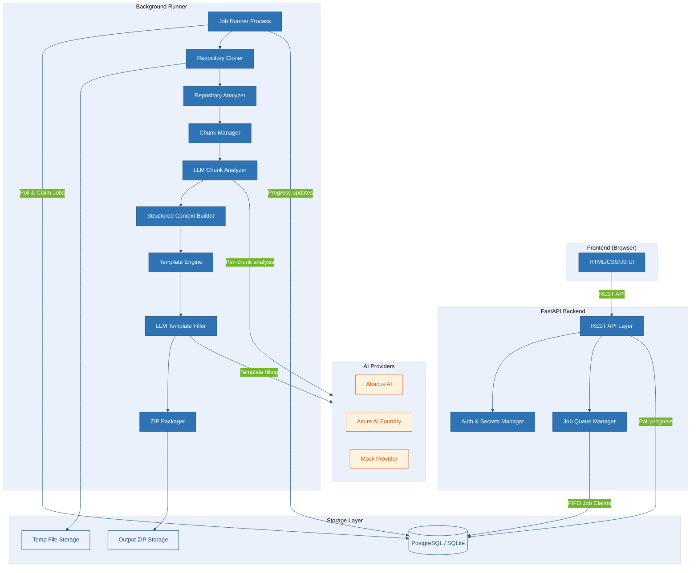

---

## 2. Component Diagram

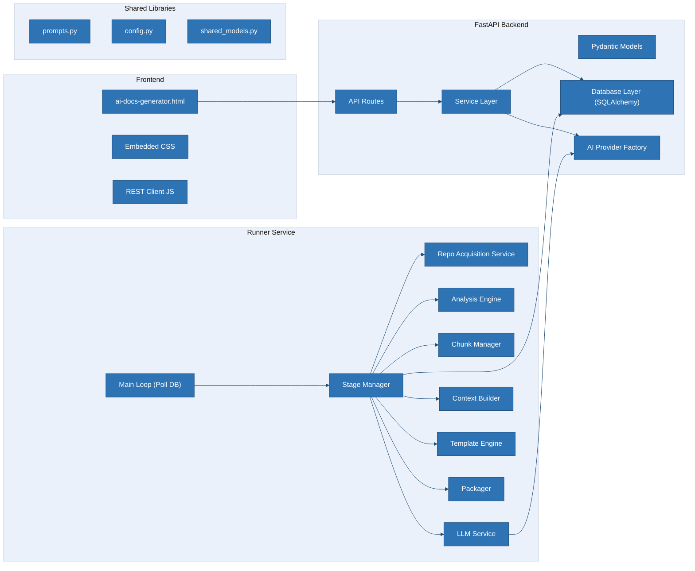

| Component | Responsibility |
|---|---|
| `API Routes` | REST endpoints for job submission, progress polling, file download |
| `Service Layer` | Business logic — job creation, queue management, validation |
| `Database Layer` | SQLAlchemy ORM with PostgreSQL/SQLite dialect switching |
| `AI Provider Factory` | Pluggable interface: Abacus AI, Azure AI Foundry, Mock |
| `Main Loop` | Polls DB for unclaimed jobs, claims atomically, delegates to Stage Manager |
| `Stage Manager` | Orchestrates the 8-stage pipeline, reports progress per stage |
| `Repo Acquisition Service` | Clones repos via `git clone` with optional PAT auth |
| `Analysis Engine` | Traverses repo, respects `.gitignore`, filters binaries, builds file index |
| `Chunk Manager` | Splits analyzed files into semantic chunks with metadata |
| `LLM Service` | Sends chunks to AI provider, extracts structured knowledge |
| `Context Builder` | Deduplicates, merges, and consolidates chunk analyses into Structured Context |
| `Template Engine` | Reads templates, maps `{{PLACEHOLDERS}}` to Structured Context sections |
| `Packager` | Generates final Markdown files + `index.json`, zips them |
| `prompts.py` | All prompt templates — system prompts, chunk analysis prompts, template filling prompts |

---

## 3. Sequence Diagram — Full Job Lifecycle

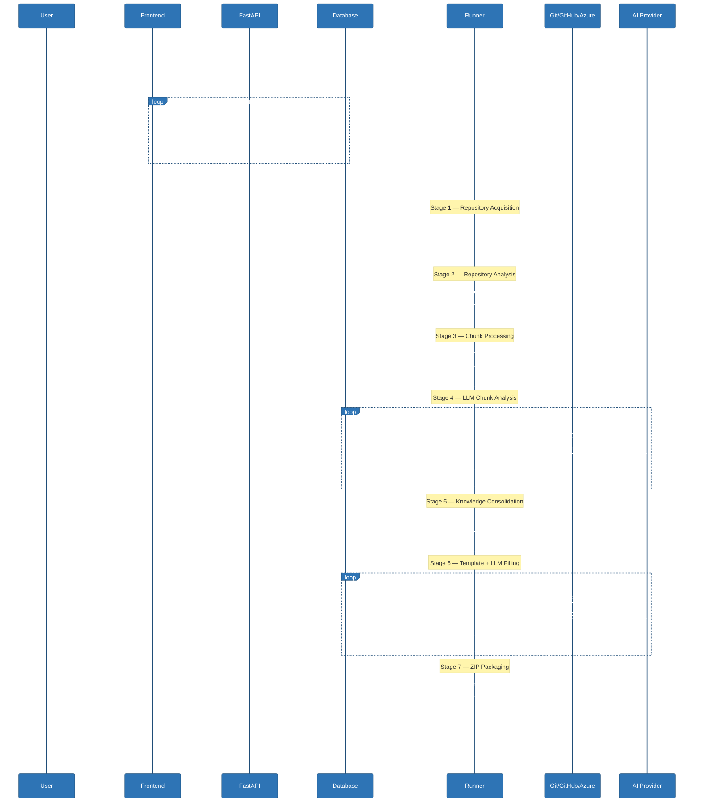

---

## 4. Queue Flow Diagram

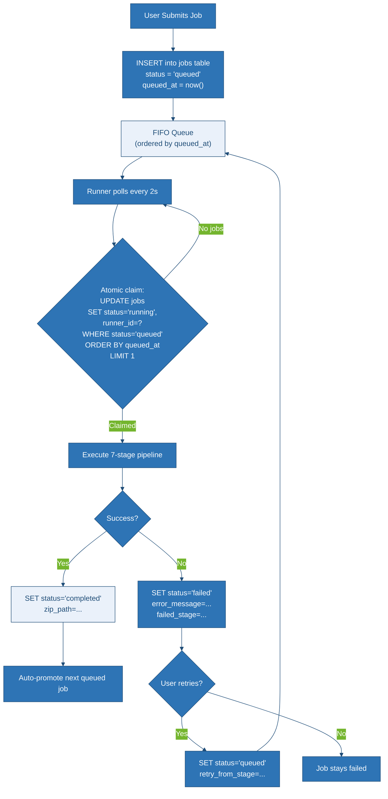

### Atomic Job Claiming (Multi-Runner Safety)

```sql
-- PostgreSQL: atomic claim with row-level locking
UPDATE jobs
SET status = 'running',
    runner_id = :runner_id,
    started_at = NOW()
WHERE id = (
    SELECT id FROM jobs
    WHERE status = 'queued'
    ORDER BY queued_at ASC
    LIMIT 1
    FOR UPDATE SKIP LOCKED
)
RETURNING *;
```

For SQLite (dev fallback), use a simpler `BEGIN EXCLUSIVE` transaction since SQLite doesn't support `SKIP LOCKED`.

### Queue Position Calculation

```sql
SELECT COUNT(*) + 1 AS position
FROM jobs
WHERE status = 'queued'
  AND queued_at < (SELECT queued_at FROM jobs WHERE id = :job_id);
```

Estimated wait time = `position × average_job_duration` (tracked as a rolling average in a `system_stats` table).

---

## 5. Repository Analysis Pipeline

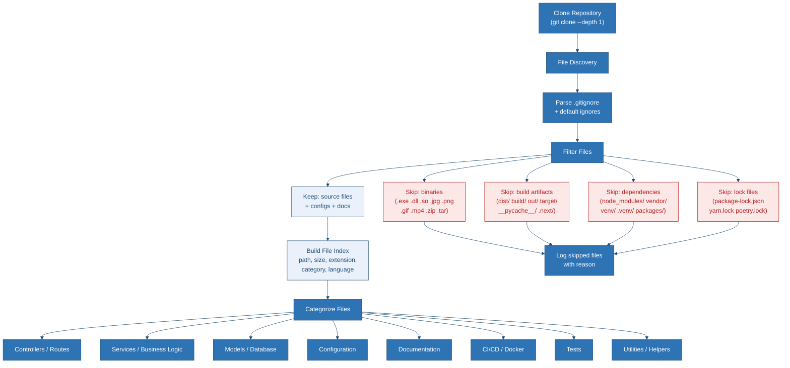

### File Categorization Rules

| Category | Pattern Match | Priority |
|---|---|---|
| Controllers/Routes | `**/controllers/**`, `**/routes/**`, `**/api/**`, `**/views/**` | 1 |
| Services | `**/services/**`, `**/business/**`, `**/logic/**`, `**/handlers/**` | 2 |
| Models/Database | `**/models/**`, `**/schema*`, `**/migrations/**`, `**/entities/**` | 3 |
| Configuration | `*.config.*`, `*.env*`, `**/config/**`, `settings.*`, `*.toml`, `*.yaml`, `*.yml` | 4 |
| Documentation | `README*`, `CHANGELOG*`, `CONTRIBUTING*`, `docs/**`, `*.md` | 5 |
| CI/CD & Docker | `Dockerfile*`, `docker-compose*`, `.github/**`, `.gitlab-ci*`, `azure-pipelines*` | 6 |
| Tests | `**/test*/**`, `*_test.*`, `*.spec.*`, `**/spec/**` | 7 |
| Utilities | Everything else that passes filters | 8 |

### Default Ignore Patterns (applied in addition to `.gitignore`)

```python
DEFAULT_IGNORES = [
    "node_modules/", "vendor/", "venv/", ".venv/", "__pycache__/",
    "dist/", "build/", "out/", "target/", ".next/", ".nuxt/",
    "*.min.js", "*.min.css", "*.map",
    "package-lock.json", "yarn.lock", "pnpm-lock.yaml", "poetry.lock",
    "*.pyc", "*.pyo", "*.class", "*.o", "*.obj",
    "*.exe", "*.dll", "*.so", "*.dylib",
    "*.jpg", "*.jpeg", "*.png", "*.gif", "*.bmp", "*.ico", "*.svg",
    "*.mp4", "*.mp3", "*.wav", "*.avi",
    "*.zip", "*.tar", "*.gz", "*.rar", "*.7z",
    "*.pdf", "*.doc", "*.docx", "*.xls", "*.xlsx",
    ".git/", ".svn/", ".hg/",
    "*.woff", "*.woff2", "*.ttf", "*.eot",
]
```

---

## 6. Chunk Processing Pipeline

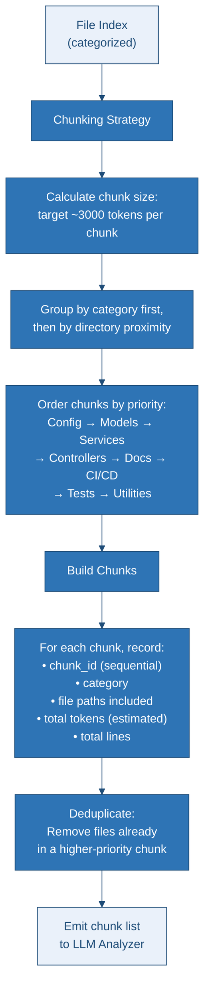

### How Chunk Size is Decided

1. **Target**: ~3,000 tokens per chunk (≈12,000 characters). This leaves headroom for the system prompt + analysis instructions within a 16K context window.
2. **Measurement**: Token count is estimated using the `tiktoken` library (`cl100k_base` encoding) or a character-based heuristic (1 token ≈ 4 chars).
3. **File-level granularity**: Files are never split mid-file. If a single file exceeds 3,000 tokens, it becomes its own chunk (up to 8,000 tokens). Files over 8,000 tokens are truncated with a `[TRUNCATED]` marker.
4. **Category packing**: Files from the same category are packed into the same chunk until the token limit is reached.

### How Chunks are Ordered

Priority order (highest first):
1. **README / Documentation** — gives the LLM project-level context first
2. **Configuration** — `.env`, `config.yaml`, `settings.py` — establishes tech stack
3. **Models / Database** — data layer shapes everything else
4. **Services / Business Logic** — core functionality
5. **Controllers / Routes** — API surface
6. **CI/CD / Docker** — deployment topology
7. **Tests** — reveals expected behavior
8. **Utilities** — helpers, lowest priority

### How Metadata is Stored

Every chunk is recorded in the `chunk_metadata` table:

```
chunk_id | job_id | chunk_number | category | file_paths (JSON array)
token_count | line_count | status | analysis_result_id
```

### How Duplicate Information is Removed

- **Pre-LLM**: During chunking, a file that appears in multiple categories (e.g., `models/user.py` matches both "Models" and "Services" globs) is assigned to the highest-priority category only.
- **Post-LLM**: The Context Builder stage deduplicates by running a merge pass over all chunk analyses, collapsing entries with the same key (e.g., two chunks both report "Uses PostgreSQL" → kept once with both source paths).

### How Memory is Managed

- Files are read from disk on demand, never all loaded into memory.
- Only the current chunk's text is held in memory during LLM calls.
- Chunk analyses are written to DB immediately after each LLM response, then the chunk text is released.
- For repos with >100K files, the analysis engine streams the file index and batches chunks without materializing the full list.

### How Token Usage is Minimized

- **Chunking**: Only relevant source code is sent, not the entire repo.
- **Structured extraction**: Chunk analysis returns JSON, not prose — compact output.
- **Structured Context**: The consolidated context replaces raw code with structured facts.
- **Templates**: The LLM fills placeholders, not generates from scratch — reducing output tokens.
- **No re-sending**: The original repo is never sent during template filling; only the Structured Context is.

---

## 7. Template Engine Flow

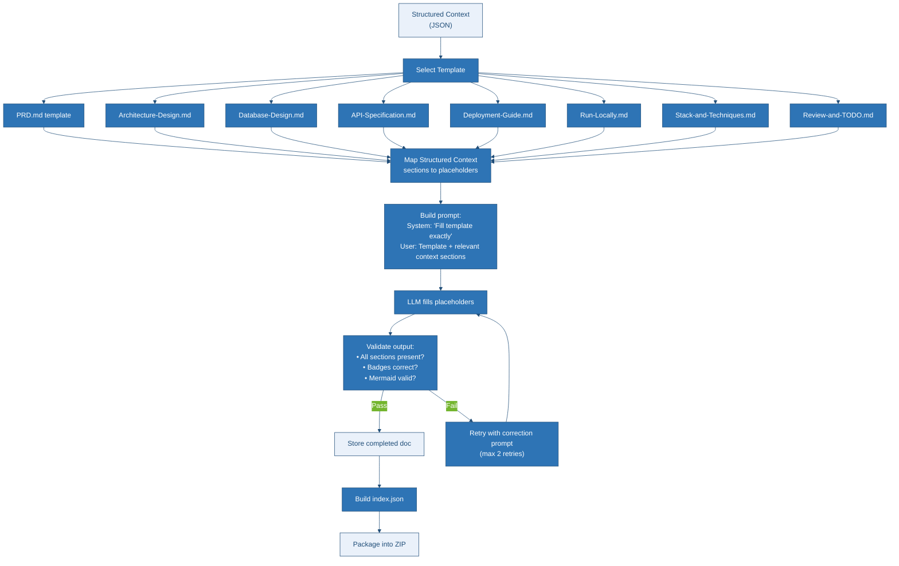

### Template-to-Context Mapping

| Template | Structured Context Sections Used |
|---|---|
| PRD.md | `SYSTEM_OVERVIEW`, `MODULES`, `BUSINESS_LOGIC`, `DEPENDENCIES` |
| Architecture-Design.md | `SYSTEM_OVERVIEW`, `ARCHITECTURE`, `MODULES`, `SERVICES` |
| Database-Design.md | `DATABASE`, `MODELS`, `CONFIGURATION` |
| API-Specification.md | `API_ENDPOINTS`, `AUTHENTICATION`, `MODULES` |
| Deployment-Guide.md | `DEPLOYMENT`, `DOCKER`, `CI_CD`, `CONFIGURATION`, `ENV_VARIABLES` |
| Run-Locally.md | `DEPENDENCIES`, `CONFIGURATION`, `ENV_VARIABLES`, `DEPLOYMENT` |
| Stack-and-Techniques.md | `TECH_STACK`, `DEPENDENCIES`, `CODING_PATTERNS`, `MODULES` |
| Review-and-TODO.md | `MISSING_FEATURES`, `SECURITY`, `ASSUMPTIONS`, `UNKNOWN_AREAS` |

### Prompt Strategy for Template Filling

```
SYSTEM: You are a senior technical writer. You will receive a template with
{PLACEHOLDER} markers and a Structured Context JSON. Fill every placeholder
using ONLY the Structured Context. Keep the template structure, badges,
Mermaid themes, and section order EXACTLY as provided. Where information
is missing, write "Information Not Found" or "Not Implemented." Never
hallucinate. Output the completed Markdown only.

USER:
## Template:
[full template text]

## Structured Context:
[relevant context sections as JSON]

## Project Name: {project_name}
## Repository URL: {repo_url}
```

---

## 8. Database ER Diagram

```mermaid
%%{init: {'theme':'base','themeVariables':{'primaryColor':'#2E74B5','primaryTextColor':'#ffffff','primaryBorderColor':'#1F4D78','lineColor':'#1F4D78','tertiaryColor':'#EAF1FA'}}}%%
erDiagram
    jobs {
        uuid id PK
        varchar project_name
        varchar repo_url
        varchar source_type "github | azure_devops"
        varchar ai_provider "abacus | azure_ai | mock"
        varchar status "queued | running | completed | failed | cancelled"
        varchar runner_id "nullable"
        varchar failed_stage "nullable"
        varchar error_message "nullable"
        varchar retry_from_stage "nullable"
        int retry_count
        varchar zip_path "nullable"
        timestamp queued_at
        timestamp started_at "nullable"
        timestamp completed_at "nullable"
        timestamp created_at
        timestamp updated_at
    }

    job_secrets {
        uuid id PK
        uuid job_id FK
        text encrypted_pat "nullable — AES-256 encrypted"
        timestamp created_at
    }

    job_progress {
        uuid id PK
        uuid job_id FK
        varchar stage "cloning | analyzing | chunking | llm_analysis | context_building | template_filling | packaging"
        int percent "0-100"
        varchar message "nullable"
        int current_chunk "nullable"
        int total_chunks "nullable"
        int current_template "nullable"
        int total_templates "nullable"
        timestamp updated_at
    }

    file_index {
        uuid id PK
        uuid job_id FK
        varchar file_path
        varchar category
        int file_size_bytes
        varchar language "nullable"
        varchar status "analyzed | skipped"
        varchar skip_reason "nullable"
        timestamp created_at
    }

    chunk_metadata {
        uuid id PK
        uuid job_id FK
        int chunk_number
        varchar category
        jsonb file_paths "array of paths"
        int estimated_tokens
        int line_count
        varchar status "pending | analyzed | failed"
        timestamp created_at
    }

    chunk_analysis {
        uuid id PK
        uuid chunk_id FK
        uuid job_id FK
        jsonb extracted_knowledge "structured JSON"
        jsonb source_mapping "file_path → knowledge_keys"
        int input_tokens
        int output_tokens
        float duration_seconds
        timestamp created_at
    }

    structured_context {
        uuid id PK
        uuid job_id FK
        jsonb context_data "consolidated JSON"
        jsonb source_traceability "section → source files"
        int total_input_tokens
        int total_output_tokens
        timestamp created_at
    }

    template_results {
        uuid id PK
        uuid job_id FK
        varchar template_name
        text generated_content
        int input_tokens
        int output_tokens
        float duration_seconds
        int retry_count
        varchar status "completed | failed"
        timestamp created_at
    }

    output_files {
        uuid id PK
        uuid job_id FK
        varchar filename
        int word_count
        int size_bytes
        timestamp created_at
    }

    job_logs {
        uuid id PK
        uuid job_id FK
        varchar level "info | warn | error | debug"
        varchar stage "nullable"
        text message
        timestamp created_at
    }

    system_stats {
        uuid id PK
        float avg_job_duration_seconds
        int total_jobs_completed
        int total_jobs_failed
        timestamp updated_at
    }

    jobs ||--o| job_secrets : "has"
    jobs ||--o{ job_progress : "tracks"
    jobs ||--o{ file_index : "indexes"
    jobs ||--o{ chunk_metadata : "chunks"
    jobs ||--o{ chunk_analysis : "analyzes"
    jobs ||--o| structured_context : "builds"
    jobs ||--o{ template_results : "generates"
    jobs ||--o{ output_files : "produces"
    jobs ||--o{ job_logs : "logs"
    chunk_metadata ||--o| chunk_analysis : "produces"
```

---

## 9. API Architecture

### API Endpoints

| Method | Endpoint | Description | Request Body |
|---|---|---|---|
| `POST` | `/api/jobs` | Submit a new documentation job | `{ project_name, repo_url, source_type, ai_provider, pat? }` |
| `GET` | `/api/jobs/{id}` | Get job details & status | — |
| `GET` | `/api/jobs/{id}/progress` | Get real-time progress (poll) | — |
| `GET` | `/api/jobs/{id}/queue-position` | Get current queue position + ETA | — |
| `GET` | `/api/jobs/{id}/files` | List analyzed files (traceability) | — |
| `GET` | `/api/jobs/{id}/files/skipped` | List skipped files with reasons | — |
| `GET` | `/api/jobs/{id}/chunks` | List chunks with metadata | — |
| `GET` | `/api/jobs/{id}/context` | Get structured context (debug) | — |
| `GET` | `/api/jobs/{id}/documents` | List generated documents | — |
| `GET` | `/api/jobs/{id}/documents/{name}` | Preview a single document | — |
| `GET` | `/api/jobs/{id}/download` | Download ZIP package | — |
| `POST` | `/api/jobs/{id}/retry` | Retry from failed stage | — |
| `POST` | `/api/jobs/{id}/cancel` | Cancel a running/queued job | — |
| `GET` | `/api/jobs/{id}/logs` | Get job logs | — |
| `GET` | `/api/jobs/{id}/stats` | Token usage, timing per stage | — |
| `GET` | `/api/queue` | Get global queue status (all jobs) | — |
| `GET` | `/api/health` | Health check | — |
| `GET` | `/api/providers` | List available AI providers | — |

### Request/Response Examples

**`POST /api/jobs`**

```json
// Request
{
  "project_name": "Payment Service",
  "repo_url": "https://github.com/acme/payment-api",
  "source_type": "github",
  "ai_provider": "azure_ai",
  "pat": "ghp_xxxxxxxxxxxx"
}

// Response 201
{
  "job_id": "550e8400-e29b-41d4-a716-446655440000",
  "status": "queued",
  "queue_position": 3,
  "estimated_wait_minutes": 12
}
```

**`GET /api/jobs/{id}/progress`**

```json
{
  "job_id": "550e8400-...",
  "status": "running",
  "stage": "llm_analysis",
  "stage_percent": 60,
  "overall_percent": 45,
  "current_chunk": 6,
  "total_chunks": 10,
  "message": "Analyzing chunk 6/10: Services",
  "stages": [
    { "name": "cloning", "status": "done", "duration_seconds": 4.2 },
    { "name": "analyzing", "status": "done", "duration_seconds": 1.8 },
    { "name": "chunking", "status": "done", "duration_seconds": 0.3 },
    { "name": "llm_analysis", "status": "running", "percent": 60 },
    { "name": "context_building", "status": "pending" },
    { "name": "template_filling", "status": "pending" },
    { "name": "packaging", "status": "pending" }
  ],
  "token_usage": {
    "total_input": 28500,
    "total_output": 4200
  },
  "elapsed_seconds": 45
}
```

**`GET /api/jobs/{id}/files`** (Traceability)

```json
{
  "analyzed": [
    { "path": "backend/auth.py", "category": "Services", "chunk": 3, "tokens": 450 },
    { "path": "backend/user.py", "category": "Services", "chunk": 3, "tokens": 380 },
    { "path": "api/routes.py", "category": "Controllers", "chunk": 5, "tokens": 620 }
  ],
  "skipped": [
    { "path": "node_modules/express/index.js", "reason": "dependency_directory" },
    { "path": "logo.png", "reason": "binary_image" },
    { "path": "dist/bundle.js", "reason": "build_artifact" }
  ],
  "summary": {
    "total_files": 342,
    "analyzed_count": 47,
    "skipped_count": 295,
    "total_tokens_analyzed": 32400
  }
}
```

---

## 10. Runner Architecture

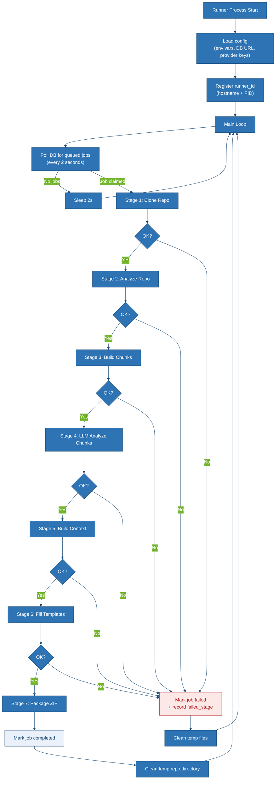

### Runner Process Details

- **Concurrency**: Each runner instance is a single Python process. It processes one job at a time (sequential within a runner).
- **Multiple runners**: Multiple runner instances can run on different machines. They safely compete for jobs via the `FOR UPDATE SKIP LOCKED` SQL pattern.
- **Heartbeat**: Every 30s during processing, the runner updates `jobs.updated_at` to prove liveness. A watchdog query can detect "stuck" jobs (no heartbeat for 5 minutes) and re-queue them.
- **Retry from stage**: When a job is retried, the runner skips stages that were already completed (using the `retry_from_stage` field). Intermediate results (chunk analyses, completed documents) are preserved.
- **Graceful shutdown**: On SIGTERM, the runner finishes the current stage, marks the job as `failed` with `error_message = "runner shutdown"`, and exits cleanly.

---

## 11. Security Architecture

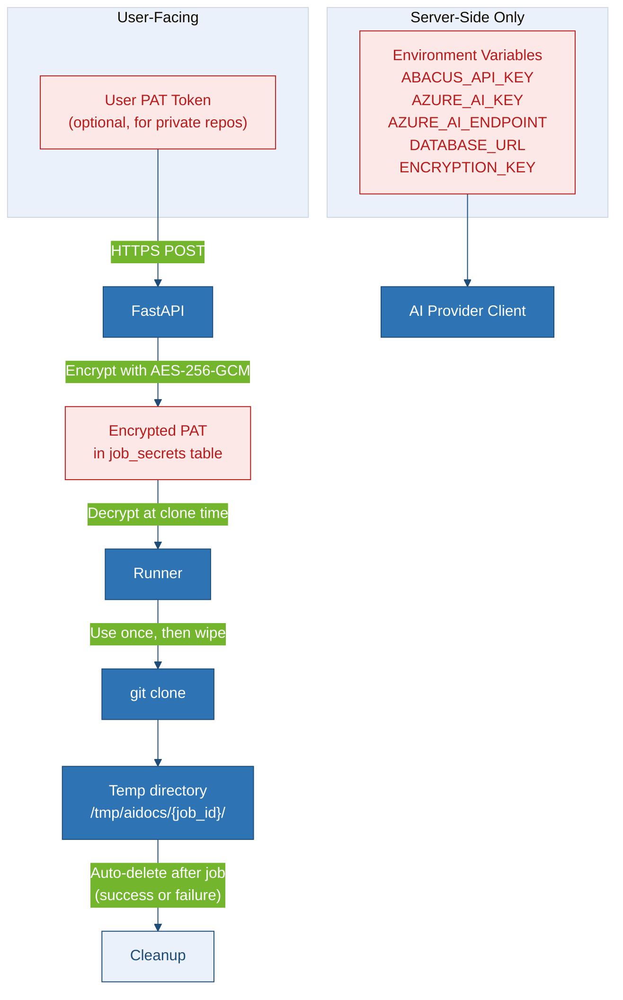

### Security Measures

| Concern | Mitigation |
|---|---|
| **PAT exposure** | Encrypted at rest (AES-256-GCM), decrypted only by runner at clone time, wiped from memory after use |
| **API keys** | Server-side env vars only — never sent to frontend, never logged |
| **Temporary repos** | Stored in isolated temp dirs (`/tmp/aidocs/{job_id}/`), deleted after job completes (success or failure) |
| **Log sanitization** | All log messages are passed through a sanitizer that redacts strings matching PAT/key patterns (`ghp_*`, `Bearer *`, etc.) |
| **CORS** | FastAPI CORS middleware configured for specific frontend origins only |
| **Input validation** | Pydantic models validate all inputs; repo URLs are parsed and validated before use |
| **Rate limiting** | Per-IP rate limiting on job submission (configurable, default: 5 jobs/hour) |
| **SQL injection** | SQLAlchemy ORM with parameterized queries exclusively |
| **File path traversal** | Repository paths are sandboxed — no `..` navigation, all reads are relative to the clone root |

---

## 12. Deployment Architecture

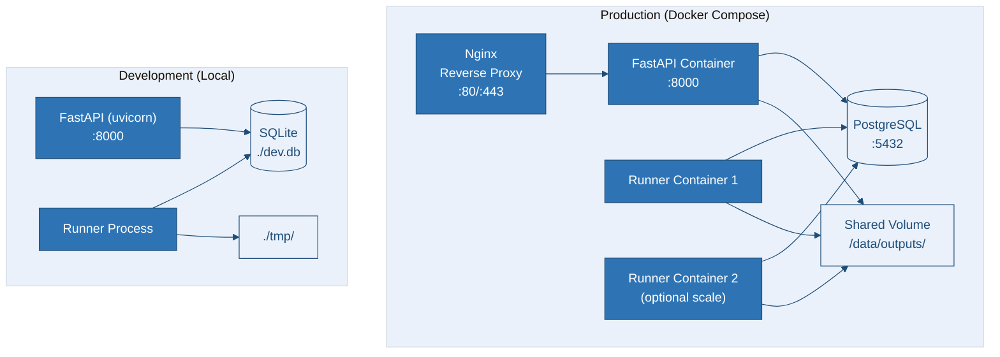

### Docker Compose Services

```yaml
services:
  api:
    build: ./backend
    ports: ["8000:8000"]
    environment:
      - DATABASE_URL=postgresql://...
      - ENCRYPTION_KEY=...
    depends_on: [db]

  runner:
    build: ./runner
    environment:
      - DATABASE_URL=postgresql://...
      - ABACUS_API_KEY=...
      - AZURE_AI_KEY=...
    volumes:
      - output_data:/data/outputs
    depends_on: [db]
    deploy:
      replicas: 1  # Scale to N for parallel processing

  db:
    image: postgres:16-alpine
    volumes:
      - pg_data:/var/lib/postgresql/data
    environment:
      - POSTGRES_DB=aidocs
      - POSTGRES_USER=aidocs
      - POSTGRES_PASSWORD=...

  nginx:
    image: nginx:alpine
    ports: ["80:80", "443:443"]
    volumes:
      - ./nginx.conf:/etc/nginx/nginx.conf
    depends_on: [api]

volumes:
  pg_data:
  output_data:
```

---

## 13. Folder Structure

```
AI Documentation/
├── backend/                          # FastAPI application
│   ├── __init__.py
│   ├── main.py                       # FastAPI app factory, CORS, lifespan
│   ├── config.py                     # Settings (Pydantic BaseSettings)
│   ├── database.py                   # SQLAlchemy engine, session factory
│   ├── models.py                     # SQLAlchemy ORM models (all tables)
│   ├── schemas.py                    # Pydantic request/response models
│   ├── routes/
│   │   ├── __init__.py
│   │   ├── jobs.py                   # /api/jobs/* endpoints
│   │   ├── queue.py                  # /api/queue endpoint
│   │   └── health.py                 # /api/health, /api/providers
│   ├── services/
│   │   ├── __init__.py
│   │   ├── job_service.py            # Job creation, status, retry logic
│   │   ├── queue_service.py          # Queue position, ETA calculation
│   │   └── file_service.py           # ZIP download, document preview
│   ├── security/
│   │   ├── __init__.py
│   │   ├── encryption.py             # AES-256-GCM encrypt/decrypt for PATs
│   │   ├── sanitizer.py              # Log sanitization
│   │   └── rate_limiter.py           # Per-IP rate limiting
│   ├── requirements.txt
│   └── Dockerfile
│
├── runner/                           # Background worker
│   ├── __init__.py
│   ├── main.py                       # Entry point — poll loop + signal handling
│   ├── config.py                     # Runner-specific settings
│   ├── stage_manager.py              # Orchestrates 7-stage pipeline
│   ├── stages/
│   │   ├── __init__.py
│   │   ├── s1_clone.py               # Stage 1: git clone with PAT
│   │   ├── s2_analyze.py             # Stage 2: file discovery + categorization
│   │   ├── s3_chunk.py               # Stage 3: chunk building
│   │   ├── s4_llm_analyze.py         # Stage 4: per-chunk LLM analysis
│   │   ├── s5_context_build.py       # Stage 5: knowledge consolidation
│   │   ├── s6_template_fill.py       # Stage 6: template + LLM filling
│   │   └── s7_package.py             # Stage 7: ZIP packaging
│   ├── providers/
│   │   ├── __init__.py
│   │   ├── base.py                   # Abstract AI provider interface
│   │   ├── abacus_provider.py        # Abacus AI implementation
│   │   ├── azure_ai_provider.py      # Azure AI Foundry implementation
│   │   └── mock_provider.py          # Mock provider for testing
│   ├── analysis/
│   │   ├── __init__.py
│   │   ├── file_filter.py            # .gitignore parsing, default ignores
│   │   ├── file_categorizer.py       # Category assignment rules
│   │   ├── chunk_builder.py          # Chunking algorithm
│   │   └── context_builder.py        # Deduplication + merge logic
│   ├── prompts.py                    # All prompt templates
│   ├── requirements.txt
│   └── Dockerfile
│
├── database/
│   ├── migrations/                   # Alembic migrations
│   │   ├── env.py
│   │   ├── alembic.ini
│   │   └── versions/
│   │       └── 001_initial_schema.py
│   └── seed.py                       # Dev seed data (optional)
│
├── shared/                           # Shared between backend + runner
│   ├── __init__.py
│   ├── models.py                     # SQLAlchemy models (imported by both)
│   ├── database.py                   # Shared DB connection logic
│   └── config.py                     # Shared configuration
│
├── templates/                        # Documentation templates (existing)
│   ├── 00-README-How-To-Use.md
│   ├── PRD.md
│   ├── Architecture Design.md
│   ├── Database Design.md
│   ├── API Specification.md
│   ├── Deployment Guide.md
│   ├── Run Locally.md
│   ├── Stack and Techniques.md
│   └── Review and TODO.md
│
├── frontend/
│   └── ai-docs-generator.html        # Single-file frontend (refactored)
│
├── docker-compose.yml
├── docker-compose.dev.yml
├── .env.example
├── .gitignore
└── README.md
```

---

## 14. Technology Stack

| Layer | Technology | Version | Purpose |
|---|---|---|---|
| **Frontend** | HTML/CSS/JS | — | Single-file UI, no build step |
| **Frontend Lib** | JSZip | 3.10.1 | Client-side ZIP preview (existing) |
| **Backend** | FastAPI | 0.115+ | REST API server |
| **Backend Runtime** | Uvicorn | 0.30+ | ASGI server |
| **ORM** | SQLAlchemy | 2.0+ | Database abstraction |
| **Migrations** | Alembic | 1.13+ | Schema migrations |
| **Validation** | Pydantic | 2.0+ | Request/response schemas |
| **Runner** | Python | 3.11+ | Background worker |
| **AI - Abacus** | `requests` / Abacus SDK | — | Abacus AI API calls |
| **AI - Azure** | `openai` SDK (Azure mode) | 1.x | Azure AI Foundry calls |
| **AI - Mock** | Built-in | — | Deterministic test responses |
| **Database (Prod)** | PostgreSQL | 16+ | Production database |
| **Database (Dev)** | SQLite | 3+ | Development fallback |
| **Token Counting** | tiktoken | 0.7+ | Accurate token estimation |
| **Git Operations** | `gitpython` / subprocess | — | Repository cloning |
| **Encryption** | `cryptography` | 43+ | AES-256-GCM for PAT encryption |
| **Rate Limiting** | `slowapi` | 0.1+ | Per-IP rate limiting |
| **Containerization** | Docker + Compose | — | Production deployment |
| **Reverse Proxy** | Nginx | — | TLS termination, static serving |

---

## 15. Database Schema (SQL)

```sql
-- PostgreSQL schema (SQLite version auto-generated by SQLAlchemy)

CREATE EXTENSION IF NOT EXISTS "uuid-ossp";

CREATE TABLE jobs (
    id              UUID PRIMARY KEY DEFAULT uuid_generate_v4(),
    project_name    VARCHAR(255) NOT NULL,
    repo_url        VARCHAR(2048) NOT NULL,
    source_type     VARCHAR(20) NOT NULL CHECK (source_type IN ('github', 'azure_devops')),
    ai_provider     VARCHAR(20) NOT NULL CHECK (ai_provider IN ('abacus', 'azure_ai', 'mock')),
    status          VARCHAR(20) NOT NULL DEFAULT 'queued'
                    CHECK (status IN ('queued','running','completed','failed','cancelled')),
    runner_id       VARCHAR(255),
    failed_stage    VARCHAR(50),
    error_message   TEXT,
    retry_from_stage VARCHAR(50),
    retry_count     INTEGER DEFAULT 0,
    zip_path        VARCHAR(512),
    queued_at       TIMESTAMP WITH TIME ZONE DEFAULT NOW(),
    started_at      TIMESTAMP WITH TIME ZONE,
    completed_at    TIMESTAMP WITH TIME ZONE,
    created_at      TIMESTAMP WITH TIME ZONE DEFAULT NOW(),
    updated_at      TIMESTAMP WITH TIME ZONE DEFAULT NOW()
);

CREATE INDEX idx_jobs_status_queued ON jobs (queued_at) WHERE status = 'queued';
CREATE INDEX idx_jobs_status ON jobs (status);

CREATE TABLE job_secrets (
    id              UUID PRIMARY KEY DEFAULT uuid_generate_v4(),
    job_id          UUID NOT NULL REFERENCES jobs(id) ON DELETE CASCADE,
    encrypted_pat   BYTEA,
    created_at      TIMESTAMP WITH TIME ZONE DEFAULT NOW(),
    UNIQUE(job_id)
);

CREATE TABLE job_progress (
    id              UUID PRIMARY KEY DEFAULT uuid_generate_v4(),
    job_id          UUID NOT NULL REFERENCES jobs(id) ON DELETE CASCADE,
    stage           VARCHAR(50) NOT NULL,
    percent         INTEGER DEFAULT 0 CHECK (percent BETWEEN 0 AND 100),
    message         TEXT,
    current_chunk   INTEGER,
    total_chunks    INTEGER,
    current_template INTEGER,
    total_templates INTEGER,
    updated_at      TIMESTAMP WITH TIME ZONE DEFAULT NOW()
);

CREATE INDEX idx_progress_job ON job_progress (job_id);

CREATE TABLE file_index (
    id              UUID PRIMARY KEY DEFAULT uuid_generate_v4(),
    job_id          UUID NOT NULL REFERENCES jobs(id) ON DELETE CASCADE,
    file_path       VARCHAR(2048) NOT NULL,
    category        VARCHAR(50),
    file_size_bytes INTEGER,
    language        VARCHAR(50),
    status          VARCHAR(20) NOT NULL CHECK (status IN ('analyzed', 'skipped')),
    skip_reason     VARCHAR(100),
    created_at      TIMESTAMP WITH TIME ZONE DEFAULT NOW()
);

CREATE INDEX idx_fileindex_job ON file_index (job_id);

CREATE TABLE chunk_metadata (
    id              UUID PRIMARY KEY DEFAULT uuid_generate_v4(),
    job_id          UUID NOT NULL REFERENCES jobs(id) ON DELETE CASCADE,
    chunk_number    INTEGER NOT NULL,
    category        VARCHAR(50),
    file_paths      JSONB NOT NULL,
    estimated_tokens INTEGER,
    line_count      INTEGER,
    status          VARCHAR(20) DEFAULT 'pending' CHECK (status IN ('pending','analyzed','failed')),
    created_at      TIMESTAMP WITH TIME ZONE DEFAULT NOW()
);

CREATE INDEX idx_chunks_job ON chunk_metadata (job_id);

CREATE TABLE chunk_analysis (
    id              UUID PRIMARY KEY DEFAULT uuid_generate_v4(),
    chunk_id        UUID NOT NULL REFERENCES chunk_metadata(id) ON DELETE CASCADE,
    job_id          UUID NOT NULL REFERENCES jobs(id) ON DELETE CASCADE,
    extracted_knowledge JSONB NOT NULL,
    source_mapping  JSONB NOT NULL,
    input_tokens    INTEGER,
    output_tokens   INTEGER,
    duration_seconds REAL,
    created_at      TIMESTAMP WITH TIME ZONE DEFAULT NOW()
);

CREATE TABLE structured_context (
    id              UUID PRIMARY KEY DEFAULT uuid_generate_v4(),
    job_id          UUID NOT NULL REFERENCES jobs(id) ON DELETE CASCADE,
    context_data    JSONB NOT NULL,
    source_traceability JSONB NOT NULL,
    total_input_tokens  INTEGER,
    total_output_tokens INTEGER,
    created_at      TIMESTAMP WITH TIME ZONE DEFAULT NOW(),
    UNIQUE(job_id)
);

CREATE TABLE template_results (
    id              UUID PRIMARY KEY DEFAULT uuid_generate_v4(),
    job_id          UUID NOT NULL REFERENCES jobs(id) ON DELETE CASCADE,
    template_name   VARCHAR(255) NOT NULL,
    generated_content TEXT NOT NULL,
    input_tokens    INTEGER,
    output_tokens   INTEGER,
    duration_seconds REAL,
    retry_count     INTEGER DEFAULT 0,
    status          VARCHAR(20) DEFAULT 'completed' CHECK (status IN ('completed','failed')),
    created_at      TIMESTAMP WITH TIME ZONE DEFAULT NOW()
);

CREATE INDEX idx_templates_job ON template_results (job_id);

CREATE TABLE output_files (
    id              UUID PRIMARY KEY DEFAULT uuid_generate_v4(),
    job_id          UUID NOT NULL REFERENCES jobs(id) ON DELETE CASCADE,
    filename        VARCHAR(255) NOT NULL,
    word_count      INTEGER,
    size_bytes      INTEGER,
    created_at      TIMESTAMP WITH TIME ZONE DEFAULT NOW()
);

CREATE TABLE job_logs (
    id              UUID PRIMARY KEY DEFAULT uuid_generate_v4(),
    job_id          UUID NOT NULL REFERENCES jobs(id) ON DELETE CASCADE,
    level           VARCHAR(10) NOT NULL CHECK (level IN ('info','warn','error','debug')),
    stage           VARCHAR(50),
    message         TEXT NOT NULL,
    created_at      TIMESTAMP WITH TIME ZONE DEFAULT NOW()
);

CREATE INDEX idx_logs_job ON job_logs (job_id, created_at);

CREATE TABLE system_stats (
    id              UUID PRIMARY KEY DEFAULT uuid_generate_v4(),
    avg_job_duration_seconds REAL DEFAULT 0,
    total_jobs_completed INTEGER DEFAULT 0,
    total_jobs_failed INTEGER DEFAULT 0,
    updated_at      TIMESTAMP WITH TIME ZONE DEFAULT NOW()
);
```

---

## 16. AI Pipeline

```mermaid
%%{init: {'theme':'base','themeVariables':{'primaryColor':'#2E74B5','primaryTextColor':'#ffffff','primaryBorderColor':'#1F4D78','lineColor':'#1F4D78','tertiaryColor':'#EAF1FA'}}}%%
flowchart TD
    REPO["Repository<br/>(cloned on disk)"] --> ANALYZER["Repository Analyzer<br/>• Traverse files<br/>• Filter & categorize<br/>• Build file index"]

    ANALYZER --> CHUNK_MGR["Chunk Manager<br/>• Group by category<br/>• Pack to ~3K tokens<br/>• Order by priority"]

    CHUNK_MGR --> LLM1["LLM Chunk Analysis<br/>(one call per chunk)"]

    LLM1 --> KG["Knowledge Store<br/>• Per-chunk JSON extractions<br/>• Source file mappings<br/>• Stored in chunk_analysis table"]

    KG --> CTX_BUILD["Structured Context Builder<br/>• Merge all chunk analyses<br/>• Deduplicate facts<br/>• Resolve conflicts<br/>• Build section hierarchy"]

    CTX_BUILD --> STRUCT_CTX["Structured Context<br/>(single consolidated JSON)"]

    STRUCT_CTX --> TMPL["Template Engine<br/>• Load template<br/>• Map context sections<br/>• Build filling prompt"]

    TMPL --> LLM2["LLM Template Filler<br/>(one call per template)"]

    LLM2 --> VALIDATE["Output Validator<br/>• Check section structure<br/>• Check badges<br/>• Check completeness"]

    VALIDATE --> DOCS["8 Markdown Documents<br/>+ index.json"]

    DOCS --> ZIP["ZIP Package"]

    classDef llm fill:#FFF3E0,stroke:#E65100,color:#E65100,stroke-width:1px;
    classDef store fill:#EAF1FA,stroke:#1F4D78,color:#1F4D78,stroke-width:1px;
    class LLM1,LLM2 llm;
    class KG,STRUCT_CTX,DOCS,ZIP store;
```

### Structured Knowledge Extraction Schema

Each chunk analysis LLM call returns JSON in this structure:

```json
{
  "project_summary": "...",
  "tech_stack": ["Python", "FastAPI", "PostgreSQL"],
  "architecture_notes": "...",
  "database_tables": [
    { "name": "users", "columns": ["id", "email", "created_at"], "source": "models/user.py" }
  ],
  "api_endpoints": [
    { "method": "POST", "path": "/api/users", "description": "Create user", "source": "routes/users.py" }
  ],
  "authentication": { "type": "JWT", "source": "auth/jwt.py" },
  "configuration": {
    "env_vars": ["DATABASE_URL", "SECRET_KEY"],
    "source": [".env.example", "config.py"]
  },
  "business_logic": "...",
  "dependencies": { "runtime": [...], "dev": [...], "source": "requirements.txt" },
  "folder_structure_notes": "...",
  "security_notes": "...",
  "deployment_notes": "...",
  "ci_cd_notes": "...",
  "docker_notes": "...",
  "coding_patterns": "...",
  "missing_features": "...",
  "assumptions": "...",
  "unknown_areas": "..."
}
```

---

## 17. Prompt Strategy

### System Prompts

**Chunk Analysis System Prompt:**
```
You are a senior software architect analyzing a code repository chunk by chunk.
Extract structured knowledge from the provided code. Return ONLY valid JSON
matching the schema provided. Be precise and factual. If something is unclear,
note it in "unknown_areas". Never infer facts you cannot support from the code.
For every piece of knowledge, track which source file(s) it came from.
```

**Template Filling System Prompt:**
```
You are a senior technical writer generating professional software documentation.
You will receive:
1. A template with {PLACEHOLDER} markers and specific structure rules.
2. A Structured Context JSON containing verified facts about the project.

Rules:
- Keep ALL template sections, badges, Mermaid themes, and section order EXACTLY.
- Replace ONLY the placeholders with information from the Structured Context.
- Where information is missing, write "Information Not Found" or "Not Implemented."
- Never hallucinate or invent features not in the context.
- Mark anything you infer as "(inferred)".
- Output the completed Markdown only — no preamble, no closing remarks.
```

### Prompt Composition Rules

1. **Chunk Analysis**: `system_prompt + schema_definition + chunk_content` — total stays under ~6K tokens.
2. **Template Filling**: `system_prompt + template_rules + template_text + relevant_context_sections` — total stays under ~8K tokens.
3. **Context sections are cherry-picked**: Each template only receives the context sections it needs (see Template-to-Context Mapping in section 7), not the full context.

---

## 18. Token Optimization Strategy

| Strategy | Where Applied | Token Savings |
|---|---|---|
| **Repository filtering** | Stage 2 — Analysis | Eliminates ~80-90% of files (dependencies, binaries, build artifacts) |
| **Chunking** | Stage 3 — Chunk Manager | Only sends ~3K tokens per LLM call instead of entire repo |
| **Structured JSON extraction** | Stage 4 — LLM Analysis | Compact output (~200-500 tokens) vs. prose (~1000+ tokens) |
| **Deduplication** | Stage 5 — Context Builder | Removes repeated facts across chunks (e.g., "uses PostgreSQL" from 3 chunks → 1 entry) |
| **Structured Context only** | Stage 6 — Template Filling | Sends ~2-4K tokens of structured facts instead of ~30K+ tokens of raw code |
| **Template constraints** | Stage 6 — Template Filling | LLM fills structure, doesn't invent it — shorter, more focused output |
| **Section-level routing** | Stage 6 — Template Filling | Each template gets only its relevant context sections, not the full context |
| **Truncation** | Stage 3 — Large files | Files >8K tokens are truncated with markers — prevents single-file blowup |

### Token Budget Per Job (Estimated)

| Stage | Input Tokens | Output Tokens | Calls |
|---|---|---|---|
| Chunk Analysis | ~3K × N chunks | ~500 × N chunks | N (typically 5-15) |
| Template Filling | ~6K × 8 templates | ~2K × 8 templates | 8 |
| **Total (10 chunks)** | **~78K** | **~21K** | **18** |
| **Total (15 chunks)** | **~93K** | **~23.5K** | **23** |

Compared to the current approach (sending full repo context in every call, 8 calls × ~9K tokens each = ~72K input, but with poor quality due to missing context), the new approach uses more total tokens but produces dramatically better results because every file is actually analyzed.

---

## 19. Mock Mode

### Design

The mock provider returns **deterministic, realistic responses** without calling any external AI API. It is designed for:

1. **Development** — iterate on the pipeline without API costs
2. **Testing** — deterministic output enables automated assertions
3. **Demo** — showcase the platform to stakeholders without API keys

### Implementation

```python
# runner/providers/mock_provider.py

class MockProvider(BaseProvider):
    """Returns pre-built responses with realistic delays."""

    def __init__(self, config):
        self.delay_seconds = config.get("mock_delay", 0.5)  # Simulate latency

    async def analyze_chunk(self, chunk_text: str, schema: dict) -> dict:
        """Return a realistic chunk analysis based on file extensions found."""
        await asyncio.sleep(self.delay_seconds)

        # Detect languages from chunk content
        languages = self._detect_languages(chunk_text)

        return {
            "project_summary": f"[Mock] Repository chunk containing {len(chunk_text)} characters",
            "tech_stack": languages,
            "architecture_notes": "[Mock] Standard layered architecture detected",
            "database_tables": [],
            "api_endpoints": self._extract_mock_endpoints(chunk_text),
            "authentication": {"type": "Not determined", "source": "mock"},
            "configuration": {"env_vars": [], "source": "mock"},
            "business_logic": "[Mock] Business logic analysis placeholder",
            "dependencies": {"runtime": [], "dev": [], "source": "mock"},
            # ... all schema fields populated with mock data
        }

    async def fill_template(self, template: str, context: dict, project_name: str) -> str:
        """Fill template placeholders with mock content."""
        await asyncio.sleep(self.delay_seconds)

        # Replace all {PLACEHOLDER} markers with mock content
        filled = template
        for key, value in context.items():
            placeholder = f"{{{{{key}}}}}"
            filled = filled.replace(placeholder, f"[Mock: {key}] {str(value)[:200]}")

        # Replace any remaining placeholders
        import re
        filled = re.sub(r'\{[A-Z_]+\}', '[Mock: Information Not Available]', filled)
        filled = re.sub(r'\{[^}]+\}', '[Mock Data]', filled)

        return filled
```

### Mock Mode Activation

```bash
# Environment variable
AI_PROVIDER=mock

# Or per-job via API
POST /api/jobs
{
  "ai_provider": "mock",
  "project_name": "Test Project",
  "repo_url": "https://github.com/owner/repo"
}
```

### Mock delays are configurable:
- `MOCK_DELAY=0` for fast CI tests
- `MOCK_DELAY=2` for realistic UX demos

---

## 20. Error Handling

| Error Category | Detection | Response |
|---|---|---|
| **Invalid repo URL** | URL parsing fails | 400 — immediate rejection with message |
| **Clone failure** | `git clone` returns non-zero | Job marked `failed`, stage=`cloning`, error logged |
| **Auth failure** | 401/403 from Git host | Job fails with "Authentication failed — check PAT" |
| **AI provider timeout** | HTTP timeout (60s default) | Retry up to 3 times with exponential backoff |
| **AI provider rate limit** | 429 response | Retry after `Retry-After` header, max 3 attempts |
| **AI provider error** | 500/502/503 | Retry with exponential backoff (2s, 4s, 8s) |
| **Invalid LLM response** | JSON parse fails or schema validation fails | Retry with correction prompt (max 2 retries per chunk) |
| **Empty LLM response** | Zero-length output | Retry once; if still empty, mark chunk as failed, continue |
| **Disk space** | `OSError` during clone/write | Job fails with "Disk space insufficient" |
| **DB connection lost** | SQLAlchemy connection error | Runner retries DB connection every 5s, pauses job processing |
| **Runner crash** | Process dies mid-job | Heartbeat timeout (5 min) → job auto-requeued by watchdog |
| **Large repo timeout** | Job exceeds max duration (configurable, default 30 min) | Job marked `failed` with "timeout", partial results preserved |

---

## 21. Retry Logic

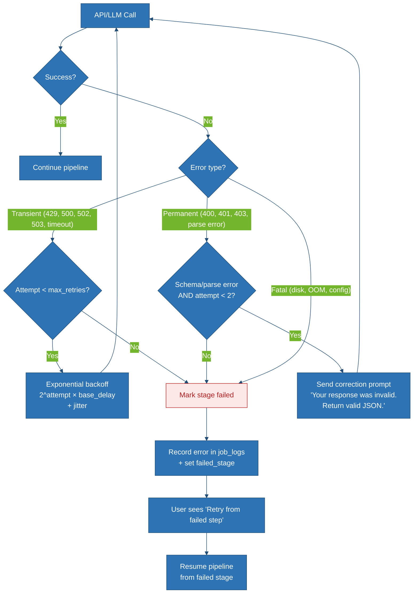

### Retry Configuration

```python
RETRY_CONFIG = {
    "max_retries": 3,
    "base_delay_seconds": 2,
    "max_delay_seconds": 30,
    "jitter_range": (0.5, 1.5),  # Multiply delay by random factor
    "retryable_status_codes": [429, 500, 502, 503, 504],
}
```

### User-Initiated Retry

When a job fails, the user can click "Retry from failed step" in the UI. This:

1. Sends `POST /api/jobs/{id}/retry`
2. Backend sets `status = 'queued'`, `retry_from_stage = {failed_stage}`, `retry_count += 1`
3. Runner picks up the job and skips already-completed stages
4. All previously completed chunk analyses and documents are preserved

---

## 22. Monitoring

| Metric | Collection Point | Storage |
|---|---|---|
| **Jobs queued** | API — on `POST /api/jobs` | `system_stats` table |
| **Jobs completed/failed** | Runner — on job completion | `system_stats` table |
| **Average job duration** | Runner — rolling average | `system_stats` table |
| **Queue depth** | API — `SELECT COUNT(*) FROM jobs WHERE status='queued'` | Computed on demand |
| **Token usage per job** | Runner — after each LLM call | `chunk_analysis`, `template_results` tables |
| **Stage duration** | Runner — timed per stage | `job_logs` table |
| **AI provider errors** | Runner — on API failure | `job_logs` table |
| **Runner heartbeat** | Runner — every 30s | `jobs.updated_at` |
| **Runner liveness** | Watchdog query — detect stuck jobs | `jobs WHERE status='running' AND updated_at < NOW() - INTERVAL '5 minutes'` |

### Health Check Endpoint

```json
// GET /api/health
{
  "status": "healthy",
  "database": "connected",
  "queue_depth": 3,
  "active_runners": 1,
  "avg_job_duration_seconds": 245,
  "total_jobs_completed": 142,
  "total_jobs_failed": 8,
  "uptime_seconds": 86400
}
```

---

## 23. Logging

### Log Levels & Destinations

| Level | What Gets Logged | Destination |
|---|---|---|
| `INFO` | Job lifecycle events, stage transitions, completion | `job_logs` table + stdout |
| `WARN` | Retries, truncated files, slow responses | `job_logs` table + stdout |
| `ERROR` | Failed stages, API errors, validation failures | `job_logs` table + stderr |
| `DEBUG` | Chunk details, prompt content (sanitized), response sizes | `job_logs` table only |

### Log Sanitization Rules

All log messages pass through a sanitizer before storage:

```python
SANITIZE_PATTERNS = [
    (r'ghp_[A-Za-z0-9_]{36,}', 'ghp_***REDACTED***'),
    (r'Bearer\s+[A-Za-z0-9\-._~+/]+=*', 'Bearer ***REDACTED***'),
    (r'(?i)pat[=:]\s*[^\s,;]+', 'pat=***REDACTED***'),
    (r'(?i)(api[_-]?key|secret|password|token)[=:]\s*[^\s,;]+', r'\1=***REDACTED***'),
]
```

### Structured Log Format

```json
{
  "timestamp": "2026-08-02T18:30:45.123Z",
  "level": "INFO",
  "job_id": "550e8400-...",
  "stage": "llm_analysis",
  "message": "Chunk 3/10 analyzed — 450 input tokens, 320 output tokens, 2.1s",
  "runner_id": "runner-01-pid-12345"
}
```

---

## 24. Future Improvements

| Priority | Improvement | Description |
|---|---|---|
| **High** | WebSocket progress | Replace polling with WebSocket push for real-time progress updates |
| **High** | Streaming LLM output | Stream template filling responses for live preview in the UI |
| **High** | User authentication | Add login/signup, API keys, job history per user |
| **Medium** | Webhook notifications | Notify external systems (Slack, Teams, email) when jobs complete |
| **Medium** | Custom templates | Let users upload their own documentation templates |
| **Medium** | Branch/tag selection | UI to pick a specific branch, tag, or commit SHA |
| **Medium** | Diff-based regeneration | On re-run, only regenerate docs for changed files |
| **Medium** | Redis queue | Replace DB-based FIFO with Redis for lower-latency queue operations |
| **Medium** | Caching layer | Cache chunk analyses — if the same file hash appears in another job, reuse |
| **Low** | React/Vue frontend | Full SPA frontend with component architecture |
| **Low** | Monorepo support | Detect and document multiple projects within a single repository |
| **Low** | LLM cost dashboard | Track and display cost per job based on token pricing |
| **Low** | PDF export | Generate PDF versions of the documentation alongside Markdown |
| **Low** | OpenAI/Google providers | Add additional AI provider integrations |
| **Low** | GitHub App integration | Install as a GitHub App for automatic doc generation on push |

---

## Proposed Changes

### Frontend

#### [MODIFY] [ai-docs-generator.html](file:///d:/AI%20Documentation/frontend/ai-docs-generator.html)
- Remove direct Claude API calls (lines 644–658)
- Replace with REST API client calling FastAPI backend
- Add AI provider selection dropdown (Abacus AI / Azure AI Foundry / Mock)
- Add PAT input field (optional, for private repos)
- Add traceability view (analyzed/skipped files with reasons)
- Add real queue position display (from API, not simulated)
- Add token usage and timing stats per stage
- Add chunk progress visualization
- Keep all existing visual design and CSS

---

### Backend (all new files)

#### [NEW] [main.py](file:///d:/AI%20Documentation/backend/main.py)
FastAPI app factory with CORS, lifespan (DB init), and router mounting.

#### [NEW] [config.py](file:///d:/AI%20Documentation/backend/config.py)
Pydantic BaseSettings loading from environment variables.

#### [NEW] [database.py](file:///d:/AI%20Documentation/backend/database.py)
SQLAlchemy async engine and session factory (PostgreSQL/SQLite).

#### [NEW] [models.py](file:///d:/AI%20Documentation/backend/models.py)
SQLAlchemy ORM models for all 10 tables.

#### [NEW] [schemas.py](file:///d:/AI%20Documentation/backend/schemas.py)
Pydantic request/response models for all API endpoints.

#### [NEW] [routes/jobs.py](file:///d:/AI%20Documentation/backend/routes/jobs.py)
All `/api/jobs/*` endpoints (submit, status, progress, files, download, retry, cancel).

#### [NEW] [routes/queue.py](file:///d:/AI%20Documentation/backend/routes/queue.py)
`/api/queue` endpoint returning global queue state.

#### [NEW] [routes/health.py](file:///d:/AI%20Documentation/backend/routes/health.py)
`/api/health` and `/api/providers` endpoints.

#### [NEW] [services/job_service.py](file:///d:/AI%20Documentation/backend/services/job_service.py)
Business logic for job creation, status queries, retry orchestration.

#### [NEW] [services/queue_service.py](file:///d:/AI%20Documentation/backend/services/queue_service.py)
Queue position calculation and ETA estimation.

#### [NEW] [services/file_service.py](file:///d:/AI%20Documentation/backend/services/file_service.py)
ZIP download streaming, document preview.

#### [NEW] [security/encryption.py](file:///d:/AI%20Documentation/backend/security/encryption.py)
AES-256-GCM encryption/decryption for PAT tokens.

#### [NEW] [security/sanitizer.py](file:///d:/AI%20Documentation/backend/security/sanitizer.py)
Log sanitization (redact secrets from log messages).

#### [NEW] [security/rate_limiter.py](file:///d:/AI%20Documentation/backend/security/rate_limiter.py)
Per-IP rate limiting middleware.

#### [NEW] [requirements.txt](file:///d:/AI%20Documentation/backend/requirements.txt)
FastAPI, uvicorn, SQLAlchemy, alembic, pydantic, cryptography, slowapi.

#### [NEW] [Dockerfile](file:///d:/AI%20Documentation/backend/Dockerfile)
Backend container definition.

---

### Runner (all new files)

#### [NEW] [main.py](file:///d:/AI%20Documentation/runner/main.py)
Entry point — poll loop, signal handling, graceful shutdown.

#### [NEW] [config.py](file:///d:/AI%20Documentation/runner/config.py)
Runner-specific settings (poll interval, timeouts, provider config).

#### [NEW] [stage_manager.py](file:///d:/AI%20Documentation/runner/stage_manager.py)
Orchestrates the 7-stage pipeline, reports progress to DB.

#### [NEW] [stages/s1_clone.py](file:///d:/AI%20Documentation/runner/stages/s1_clone.py)
Git clone with PAT authentication support.

#### [NEW] [stages/s2_analyze.py](file:///d:/AI%20Documentation/runner/stages/s2_analyze.py)
File discovery, `.gitignore` parsing, filtering, categorization.

#### [NEW] [stages/s3_chunk.py](file:///d:/AI%20Documentation/runner/stages/s3_chunk.py)
Semantic chunking algorithm with token-based sizing.

#### [NEW] [stages/s4_llm_analyze.py](file:///d:/AI%20Documentation/runner/stages/s4_llm_analyze.py)
Per-chunk LLM analysis with structured knowledge extraction.

#### [NEW] [stages/s5_context_build.py](file:///d:/AI%20Documentation/runner/stages/s5_context_build.py)
Knowledge consolidation, deduplication, conflict resolution.

#### [NEW] [stages/s6_template_fill.py](file:///d:/AI%20Documentation/runner/stages/s6_template_fill.py)
Template loading, context mapping, LLM filling, output validation.

#### [NEW] [stages/s7_package.py](file:///d:/AI%20Documentation/runner/stages/s7_package.py)
ZIP packaging with index.json manifest.

#### [NEW] [providers/base.py](file:///d:/AI%20Documentation/runner/providers/base.py)
Abstract base class for AI providers.

#### [NEW] [providers/abacus_provider.py](file:///d:/AI%20Documentation/runner/providers/abacus_provider.py)
Abacus AI implementation.

#### [NEW] [providers/azure_ai_provider.py](file:///d:/AI%20Documentation/runner/providers/azure_ai_provider.py)
Azure AI Foundry implementation.

#### [NEW] [providers/mock_provider.py](file:///d:/AI%20Documentation/runner/providers/mock_provider.py)
Mock provider for testing/development.

#### [NEW] [analysis/file_filter.py](file:///d:/AI%20Documentation/runner/analysis/file_filter.py)
`.gitignore` parsing and default ignore pattern matching.

#### [NEW] [analysis/file_categorizer.py](file:///d:/AI%20Documentation/runner/analysis/file_categorizer.py)
File category assignment rules.

#### [NEW] [analysis/chunk_builder.py](file:///d:/AI%20Documentation/runner/analysis/chunk_builder.py)
Chunk building algorithm with token estimation.

#### [NEW] [analysis/context_builder.py](file:///d:/AI%20Documentation/runner/analysis/context_builder.py)
Structured context consolidation logic.

#### [NEW] [prompts.py](file:///d:/AI%20Documentation/runner/prompts.py)
All system prompts, chunk analysis prompts, template filling prompts.

#### [NEW] [requirements.txt](file:///d:/AI%20Documentation/runner/requirements.txt)
SQLAlchemy, gitpython, tiktoken, cryptography, requests, openai.

#### [NEW] [Dockerfile](file:///d:/AI%20Documentation/runner/Dockerfile)
Runner container definition.

---

### Database

#### [NEW] [migrations/alembic.ini](file:///d:/AI%20Documentation/database/migrations/alembic.ini)
Alembic configuration.

#### [NEW] [migrations/env.py](file:///d:/AI%20Documentation/database/migrations/env.py)
Alembic environment setup.

#### [NEW] [migrations/versions/001_initial_schema.py](file:///d:/AI%20Documentation/database/migrations/versions/001_initial_schema.py)
Initial migration with all 10 tables.

---

### Shared

#### [NEW] [models.py](file:///d:/AI%20Documentation/shared/models.py)
SQLAlchemy ORM models shared between backend and runner.

#### [NEW] [database.py](file:///d:/AI%20Documentation/shared/database.py)
Shared DB session factory.

#### [NEW] [config.py](file:///d:/AI%20Documentation/shared/config.py)
Shared configuration (DB URL, encryption key).

---

### Root

#### [NEW] [docker-compose.yml](file:///d:/AI%20Documentation/docker-compose.yml)
Production Docker Compose with API, Runner, PostgreSQL, Nginx.

#### [NEW] [docker-compose.dev.yml](file:///d:/AI%20Documentation/docker-compose.dev.yml)
Development Docker Compose (SQLite, single runner).

#### [NEW] [.env.example](file:///d:/AI%20Documentation/.env.example)
Example environment variables.

#### [NEW] [.gitignore](file:///d:/AI%20Documentation/.gitignore)
Python + Node ignores.

---

## Verification Plan

### Automated Tests

```bash
# Backend API tests
cd backend && python -m pytest tests/ -v

# Runner unit tests (mock provider, chunking, context building)
cd runner && python -m pytest tests/ -v

# Integration test — full pipeline with mock provider
python -m pytest tests/integration/test_full_pipeline.py -v
```

### Manual Verification

1. **Mock mode end-to-end**: Submit a job with `ai_provider=mock`, verify all 7 stages complete, download ZIP, inspect all 8 documents + index.json.
2. **Queue behavior**: Submit 3 jobs simultaneously, verify FIFO ordering, queue position display, and sequential processing.
3. **Traceability**: After a job completes, verify the `/api/jobs/{id}/files` endpoint returns accurate analyzed/skipped file lists with correct reasons.
4. **Retry logic**: Force a failure (e.g., invalid API key), verify the job can be retried from the failed stage with previous results preserved.
5. **Frontend UX**: Verify the progress UI updates every 2 seconds, shows correct stage/chunk/percentage, and transitions to results screen on completion.
6. **Security**: Verify PATs are never visible in logs, API responses, or database (only encrypted `BYTEA`).
