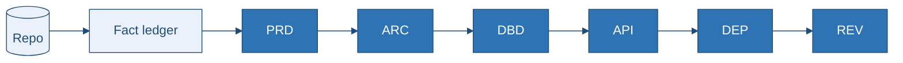

# Documentation Template Pack — Authoring Contract

> **This README is the contract. The six templates are the skeletons.** Fill them — do not invent new document shapes.

---

## 1. The Six Documents (only these)

| # | File | Answers | Audience |
|---|---|---|---|
| 1 | `PRD.md` | What does it do, for whom, under what constraints? | Product, joiners, auditors |
| 2 | `Architecture Design.md` | How is it built, and why? | Engineers, architects |
| 3 | `Database Design.md` | Where does state live, in what shape? | Data engineers, DBAs |
| 4 | `API Specification.md` | What are the contracts at every boundary? | Integrators, QA |
| 5 | `Deployment Guide.md` | How do I build, run, ship, and roll back? | SRE, DevOps |
| 6 | `Review and TODO.md` | What is wrong, and what to fix first? | Leadership, security, PM |

**Target length:** each template **200–250 lines**; this README **100–120 lines**. Keep every Mermaid diagram. Drop filler, glossaries, and duplicate appendices.

---

## 2. Non-Negotiable Rules

| # | Rule |
|---|---|
| **C1** | Keep every `##` / `###` heading from the template, in order. Do not add, remove, or rename. |
| **C2** | Empty section → `[NOT APPLICABLE] — <reason>` or `[MISSING] — searched <glob>`. Never delete the heading. |
| **C3** | Cite claims as `` `path/to/file.ext:L12-L34` ``. |
| **C4** | Never present proposed work as existing. Use `[PROPOSED]` only in Recommendations / `Review and TODO.md`. |
| **C5** | Tag inferences `[ASSUMPTION-<CAT>-###]` and register them in Review. |
| **C6** | Tables for enumerable facts; prose for reasoning. |
| **C7** | Every Mermaid block uses the init line + `classDef` library below. |
| **C8** | Secret **names** only — never values. |
| **C9** | Cross-reference other docs; do not duplicate facts. |
| **C10** | Present tense for what exists; conditional + `[PROPOSED]` for what does not. |
| **C11** | Delete every `<!-- FILL: -->` / `<!-- EXAMPLE -->` from output. Keep `<!-- ANCHOR: -->`. |

**Markers:** `[MISSING]` · `[NOT APPLICABLE]` · `[PROPOSED]` · `[DEPRECATED]` · `[CONFLICT]` · `[ASSUMPTION-BUS|ARCH|DATA|API|OPS|SEC|PERF|TEST-###]`

**Tokens:** `{{REQUIRED}}` → value or `[MISSING]` · `{{?OPTIONAL}}` → value or `—` · `{{#EACH x}}…{{/EACH}}` → one row per item

---

## 3. Mermaid Standard

Every `flowchart` / `sequenceDiagram` / `erDiagram` / `stateDiagram-v2` / `classDiagram` starts with:

```text
%%{init: {'theme':'base','themeVariables':{'primaryColor':'#2E74B5','primaryTextColor':'#ffffff','primaryBorderColor':'#1F4D78','lineColor':'#1F4D78','secondaryColor':'#EAF1FA','tertiaryColor':'#EAF1FA','fontFamily':'Segoe UI, Inter, sans-serif','fontSize':'14px'}}}%%
```

Shared classes (paste what you use):

```text
    classDef core     fill:#2E74B5,stroke:#1F4D78,color:#ffffff,stroke-width:1px;
    classDef store    fill:#EAF1FA,stroke:#1F4D78,color:#1F4D78,stroke-width:1px;
    classDef external fill:#F0E9FA,stroke:#6B4E9E,color:#4A356F,stroke-width:1px;
    classDef ai       fill:#FFF3E0,stroke:#E65100,color:#8A3800,stroke-width:1px;
    classDef danger   fill:#FDE8E8,stroke:#B91C1C,color:#B91C1C,stroke-width:1px;
    classDef success  fill:#E3F5EA,stroke:#1E7A4B,color:#12613A,stroke-width:1px;
    classDef warn     fill:#FEF3C7,stroke:#B45309,color:#92400E,stroke-width:1px;
    classDef proposed fill:#F5F7FA,stroke:#94A3B8,color:#475569,stroke-dasharray:4 3;
```

**Never** use Mermaid hexagon `nodeId{{label}}` — it collides with placeholders. Use `nodeId["label"]`.

| Document | Min diagrams |
|---|---|
| PRD | context, feature tree, journey, experience `journey`, entity `stateDiagram-v2`, debt `quadrantChart` |
| Architecture | context, container, component, ≥1 sequence, resilience, trust boundary |
| Database | logical `erDiagram`, lifecycle `stateDiagram-v2`, read/write `flowchart` |
| API | auth `sequenceDiagram`, error `flowchart`, payload `classDiagram` |
| Deployment | topology, CI/CD, release/git, rollback tree |
| Review | risk `quadrantChart`, remediation `gantt`, finding dependency `flowchart` |

---

## 4. Generation Order & Pipeline



1. **Survey** — fact ledger only (claim → file:line → V/I/U). No prose.
2. **Draft** — fill PRD → Architecture → Database → API → Deployment from the ledger.
3. **Cross-check** — reconcile contradictions; insert § links.
4. **Review last** — consolidate assumptions, gaps, findings; score confidence.

---

## 5. Master Prompt (paste with templates + repo)

```text
Follow 00-README-HOW_To-Use.md rules C1–C11. Keep every template heading.
Cite path:Lstart-Lend. Tag inferences [ASSUMPTION-*-###]. Never invent endpoints/tables.
No secret values. Keep all Mermaid diagrams; use §3 init + classDef.
Delete FILL/EXAMPLE comments. Target 200–250 lines per doc.
PASS 1: fact ledger. PASS 2: five docs in order. PASS 3: reconcile.
PASS 4: Review and TODO.md last. Begin PASS 1.
```
