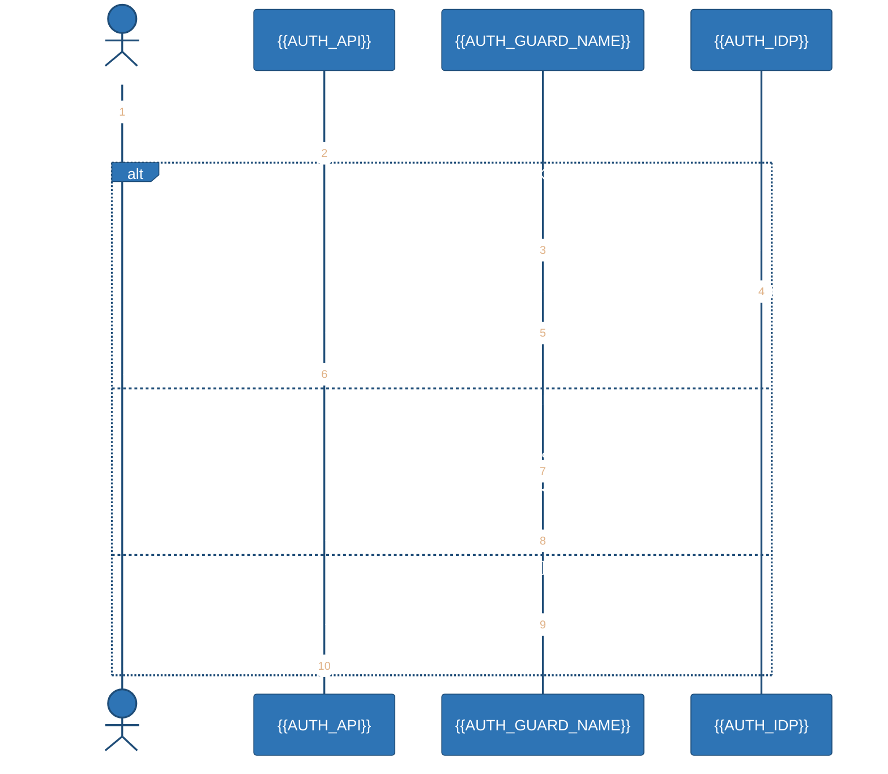
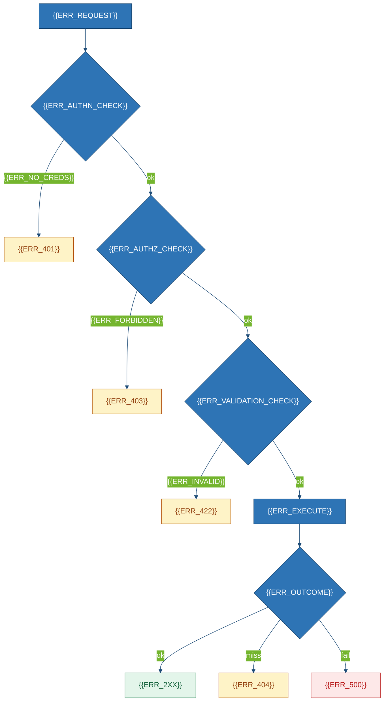

# API Specification
### {{PROJECT_NAME}}

## 1. Overview
{{API_SUMMARY}}

| Property | Value | Evidence |
|---|---|---|
| Transport / base / port | {{TRANSPORT}} · `{{BASE_URL_PROD}}` · `{{DEFAULT_PORT}}` | `{{TRANSPORT_EVIDENCE}}` |
| Content / Auth / Version | `{{REQ_CONTENT_TYPE}}`→`{{RES_CONTENT_TYPE}}` · {{AUTH_SCHEME}} · {{VERSIONING}} | § 2 |
| Endpoints P/A/I/D/H · total | {{COUNT_PUBLIC}}/{{COUNT_ADMIN}}/{{COUNT_INTERNAL}}/{{COUNT_DEBUG}}/{{COUNT_HEALTH}} · **{{ENDPOINT_COUNT}}** | § 3–5 |
| Path / field / ID / ts | {{PATH_CASING}} · {{FIELD_CASING}} · {{ID_FORMAT}} · {{TIMESTAMP_FORMAT}} | `{{PATH_EVIDENCE}}` |

**Discovery.** {{DISCOVERY_METHOD}}

## 2. Auth
| Property | Value | Evidence |
|---|---|---|
| Scheme / transport / lifetime | {{AUTH_SCHEME}} · {{AUTH_TRANSPORT}} · {{TOKEN_LIFETIME}} | `{{AUTH_SCHEME_EVIDENCE}}` |
| Guard / default | {{AUTH_GUARD}} · {{AUTH_DEFAULT}} | `{{AUTH_GUARD_EVIDENCE}}` |

> [!WARNING]
> {{AUTH_WARNING}}



| Role | Check | Endpoints | Evidence |
|---|---|---|---|
{{#EACH auth_roles}}
| `{{AR_ROLE}}` | {{AR_CHECK}} | {{AR_ENDPOINTS}} | `{{AR_EVIDENCE}}` |
{{/EACH}}
{{#EACH open_endpoints}}
| OPEN `{{OE_ENDPOINT}}` | {{OE_REASON}} | risk={{OE_RISK}} | `{{OE_EVIDENCE}}` |
{{/EACH}}

## 3. Catalogue
| # | Method | Path | Auth | Purpose | § |
|---|---|---|---|---|---|
{{#EACH endpoint_catalogue}}
| {{EC_N}} | `{{EC_METHOD}}` | `{{EC_PATH}}` | {{EC_AUTH}} | {{EC_PURPOSE}} | {{EC_SECTION}} |
{{/EACH}}

## 4. Product Surface
{{#EACH endpoints}}
### 4.{{INDEX}} `{{METHOD}} {{PATH}}`
{{ENDPOINT_DESCRIPTION}} · Auth {{ENDPOINT_AUTH}} · Idempotent {{ENDPOINT_IDEMPOTENT}} · Effects {{ENDPOINT_SIDE_EFFECTS}} · `{{ENDPOINT_EVIDENCE}}`

| Field | In | Type | Req | Constraints |
|---|---|---|:--:|---|
{{#EACH body_fields}}
| `{{BF_NAME}}` | body | `{{BF_TYPE}}` | {{BF_REQUIRED}} | {{BF_CONSTRAINTS}} |
{{/EACH}}
{{#EACH query_params}}
| `{{QP_NAME}}` | query | `{{QP_TYPE}}` | {{QP_REQUIRED}} | {{QP_CONSTRAINTS}} |
{{/EACH}}

```http
{{METHOD}} {{PATH}} HTTP/1.1
Authorization: Bearer ***REDACTED***
Content-Type: application/json

{{REQUEST_EXAMPLE}}
```

```json
{{RESPONSE_EXAMPLE}}
```

| Status | Meaning | When |
|---|---|---|
{{#EACH endpoint_responses}}
| `{{ER_STATUS}}` | {{ER_MEANING}} | {{ER_CONDITION}} |
{{/EACH}}
{{/EACH}}

## 5. Admin / Debug / Health
| Method & path | Role / Exposes | Purpose / Gate | Evidence |
|---|---|---|---|
{{#EACH admin_endpoints}}
| `{{AE_METHOD}} {{AE_PATH}}` | {{AE_ROLE}} | {{AE_PURPOSE}} | `{{AE_EVIDENCE}}` |
{{/EACH}}
{{#EACH debug_endpoints}}
| `{{DE_METHOD}} {{DE_PATH}}` | {{DE_EXPOSES}} | {{DE_GATING}} | `{{DE_EVIDENCE}}` |
{{/EACH}}
{{#EACH health_endpoints}}
| `{{HE_METHOD}} {{HE_PATH}}` | {{HE_AUTH}} | {{HE_RESPONSE}} | `{{HE_EVIDENCE}}` |
{{/EACH}}

> [!CAUTION]
> {{DEBUG_CAUTION}}

{{HEALTH_NARRATIVE}}

## 6. Models
```mermaid
%%{init: {'theme':'base','themeVariables':{'primaryColor':'#2E74B5','primaryTextColor':'#ffffff','primaryBorderColor':'#1F4D78','lineColor':'#1F4D78','tertiaryColor':'#EAF1FA','fontFamily':'Segoe UI, Inter, sans-serif','fontSize':'13px'}}}%%
classDiagram
    class {{MODEL_1}} {
        +{{M1_F1_TYPE}} {{M1_F1_NAME}}
        +{{M1_F2_TYPE}} {{M1_F2_NAME}}
        +{{M1_F3_TYPE}} {{M1_F3_NAME}}
    }
    class {{MODEL_2}} {
        +{{M2_F1_TYPE}} {{M2_F1_NAME}}
        +{{M2_F2_TYPE}} {{M2_F2_NAME}}
    }
    class {{MODEL_ERROR}} {
        +{{ME_F1_TYPE}} {{ME_F1_NAME}}
        +{{ME_F2_TYPE}} {{ME_F2_NAME}}
    }
    {{MODEL_1}} --> {{MODEL_2}} : {{MODEL_REL_12}}
```

{{#EACH models}}
#### `{{MODEL_NAME}}` — `{{MODEL_EVIDENCE}}`
| Field | Type | Req | Description |
|---|---|:--:|---|
{{#EACH model_fields}}
| `{{MF_NAME}}` | `{{MF_TYPE}}` | {{MF_REQUIRED}} | {{MF_DESC}} |
{{/EACH}}
{{/EACH}}

## 7. Errors
{{ERROR_ENVELOPE_NARRATIVE}}

```json
{{ERROR_ENVELOPE_EXAMPLE}}
```



| Code | HTTP | Meaning | Retry | Evidence |
|---|---|---|:--:|---|
{{#EACH error_catalogue}}
| `{{ERR_CODE}}` | `{{ERR_HTTP}}` | {{ERR_MEANING}} | {{ERR_RETRYABLE}} | `{{ERR_EVIDENCE}}` |
{{/EACH}}

## 8. Cross-cutting & Gaps
| Capability | Detail | Evidence |
|---|---|---|
| Page / Filter / Sort | {{PAGE_SUPPORTED}} · {{PAGE_MECHANISM}} | `{{PAGE_EVIDENCE}}` |
| Idempotency / Rate | {{IDEMPOTENCY_KEYS}} · {{RATE_LIMIT_STATUS}} | `{{IDEMPOTENCY_EVIDENCE}}` |
| CORS / TLS / Size | {{CORS_ORIGINS}} · {{TLS_ENFORCEMENT}} · {{SIZE_LIMITS}} | `{{CORS_EVIDENCE}}` |

{{ASYNC_NARRATIVE}}

| ID / Gap | Detail | Impact |
|---|---|---|
{{#EACH api_assumptions}}
| `{{ASSUMPTION_ID}}` | {{ASSUMPTION_TEXT}} | {{ASSUMPTION_IMPACT}} · § {{ASSUMPTION_SECTION}} |
{{/EACH}}
{{#EACH api_gaps}}
| GAP | {{GAP_ITEM}} · `{{GAP_SEARCH}}` | {{GAP_CONSEQUENCE}} |
{{/EACH}}

<!-- ANCHOR: api-end -->
*End of `{{PROJECT_SLUG}}-API-001` → *`Deployment Guide.md`*.*
