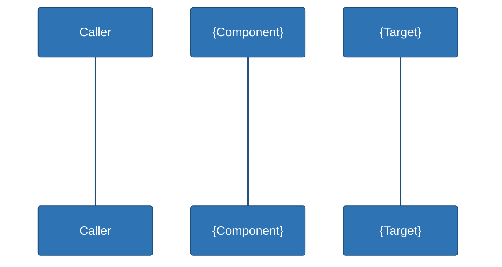

 

# API Specification
### {Project Name}

---

## 1. Current State

{State plainly whether a real HTTP/GraphQL API exists. If not: "There is no REST/GraphQL API in this repository." Describe how each front end/consumer actually gets its result instead (in-process call, local function, etc.).}

## 2. Interface Contract A — {Name, e.g. component/service} (`{file}`)

{One line: is this a real HTTP endpoint, or a direct in-process call?}

```{language}
{minimal real code snippet showing the actual call, 3–6 lines}
```

| Input | Type | Source |
|---|---|---|
| `{param_1}` | `{type}` | `{where it comes from}` |
| `{param_2}` | `{type}` | `{where it comes from}` |

**Output:** {what's returned, its type, and how it's rendered/displayed}.

{One sentence on input validation status — be specific about what is and isn't checked. Cross-ref *Review-and-TODO.md* if gaps exist.}

## 3. Interface Contract B — {Name, if a second consumer/track exists}

{Same shape as section 2. Omit this whole section if there's only one interface.}

```{language}
{signature}
```

```{language}
{call site}
```

| Parameter | Type | Notes |
|---|---|---|
| `{param}` | `{type}` | {notes} |

**Returns:** {type and formatting}.



## 4. Proposed {REST/GraphQL} API *(inferred — not implemented, if applicable)*

{Only include if a shared/formal API is a sensible future step. State this is proposed, not present.}

### `{METHOD} {/api/path}`

**Request body**

```json
{
  "{field_1}": "{example}",
  "{field_2}": "{example}"
}
```

**Response `200 OK`**

```json
{
  "{result_field}": "{example}",
  "{version_field}": "{example}"
}
```

**Response `400 Bad Request`**

```json
{
  "error": "{example validation message}"
}
```

| Endpoint | Method | Description |
|---|---|---|
| `{/api/path}` | `{METHOD}` | {Description} |
| `/api/health` | `GET` | Liveness check *(proposed)* |
| `{/api/version-endpoint}` | `GET` | {Description} *(proposed)* |

### Error handling conventions *(proposed)*

- `400` for {malformed/out-of-range input examples}.
- `500` for {unexpected server-side failure examples}.
- All error responses use a consistent `{ "error": "<message>" }` shape.

{Closing sentence: what problem would this proposed API solve relative to the current duplicated/ad-hoc approach — cross-ref *Architecture-Design.md*.}
