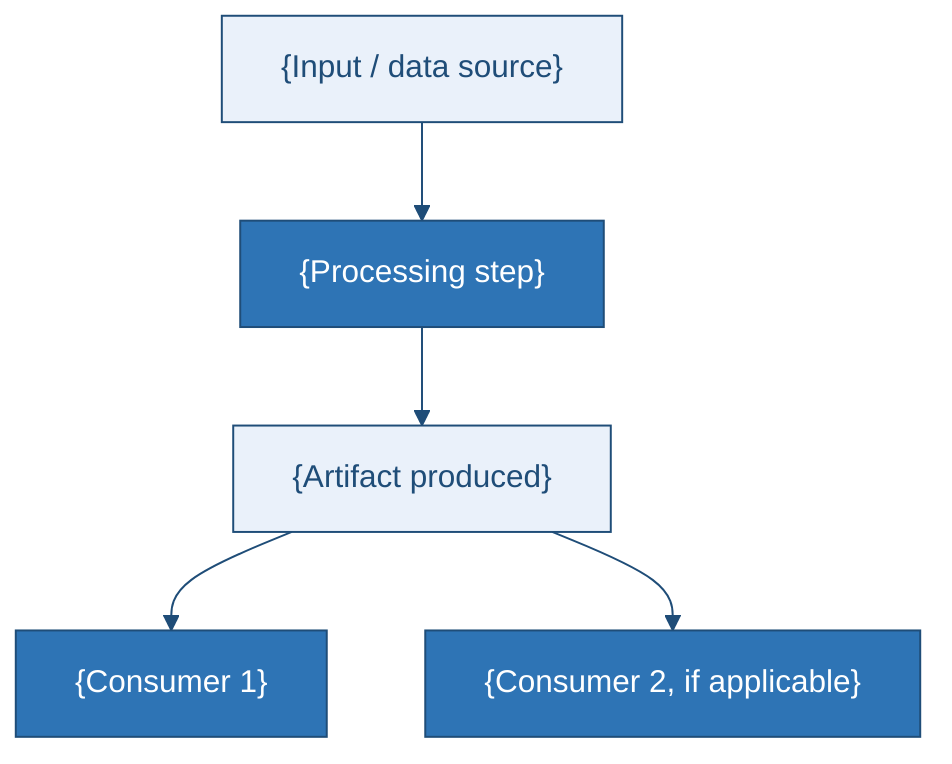
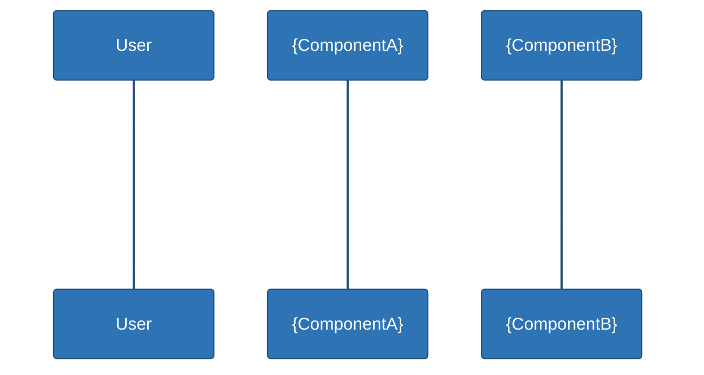

 

# Architecture Design
### {Project Name}

---

## 1. Overview

{1–3 sentences describing the high-level shape of the system: how many runtime paths/services exist, and where they diverge or share infrastructure.}



## 2. Components & Responsibilities

| Component | Responsibility |
|---|---|
| `{component_1}` | {What it does, in one sentence} |
| `{component_2}` | {What it does, in one sentence} |
| `{component_3}` | {What it does, in one sentence} |
| `{component_4}` | {What it does, in one sentence} |

## 3. Runtime Architecture

{If there is more than one deployment/runtime path, diagram each as a subgraph. If there's only one, use a single flowchart without subgraphs.}

```mermaid
%%{init: {'theme':'base','themeVariables':{'primaryColor':'#2E74B5','primaryTextColor':'#ffffff','primaryBorderColor':'#1F4D78','lineColor':'#1F4D78','secondaryColor':'#0563C1','secondaryTextColor':'#ffffff','tertiaryColor':'#EAF1FA'}}}%%
flowchart LR
    subgraph Track_A["{Track A name}"]
        U1["User"] -->|{protocol}| S1["{service}"]
        S1 -->|renders result| U1
    end

    subgraph Track_B["{Track B name, if applicable}"]
        U2["User"] -->|{protocol}| V1["{service}"]
        V1 -->|renders result| U2
    end
```

**Key design decision:** {1–2 sentences on the central architectural choice and why it was made, e.g. "compiled inference over a live API" or "monolith over microservices" — name the specific trade-off.}

## 4. Data Flow (Single {Primary Action})



## 5. Key Design Decisions

- **{Decision 1}** — {rationale}
- **{Decision 2}** — {rationale}
- **{Decision 3}** — {rationale, e.g. documentation/design-system as first-class artifact}

## 6. Trade-offs

| Choice | Benefit | Cost |
|---|---|---|
| {Choice 1} | {Benefit} | {Cost / risk} |
| {Choice 2} | {Benefit} | {Cost / risk} |
| {Choice 3} | {Benefit} | {Cost / risk} |
