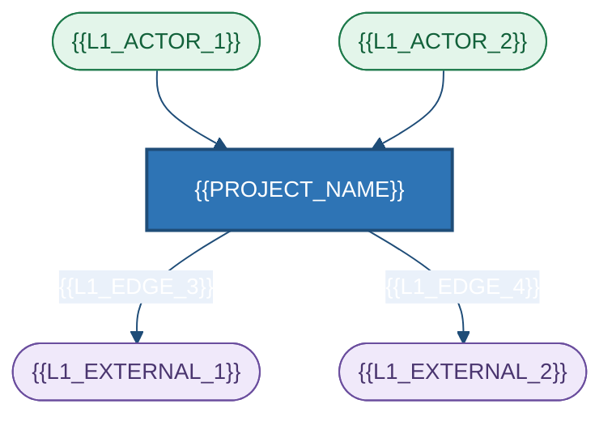
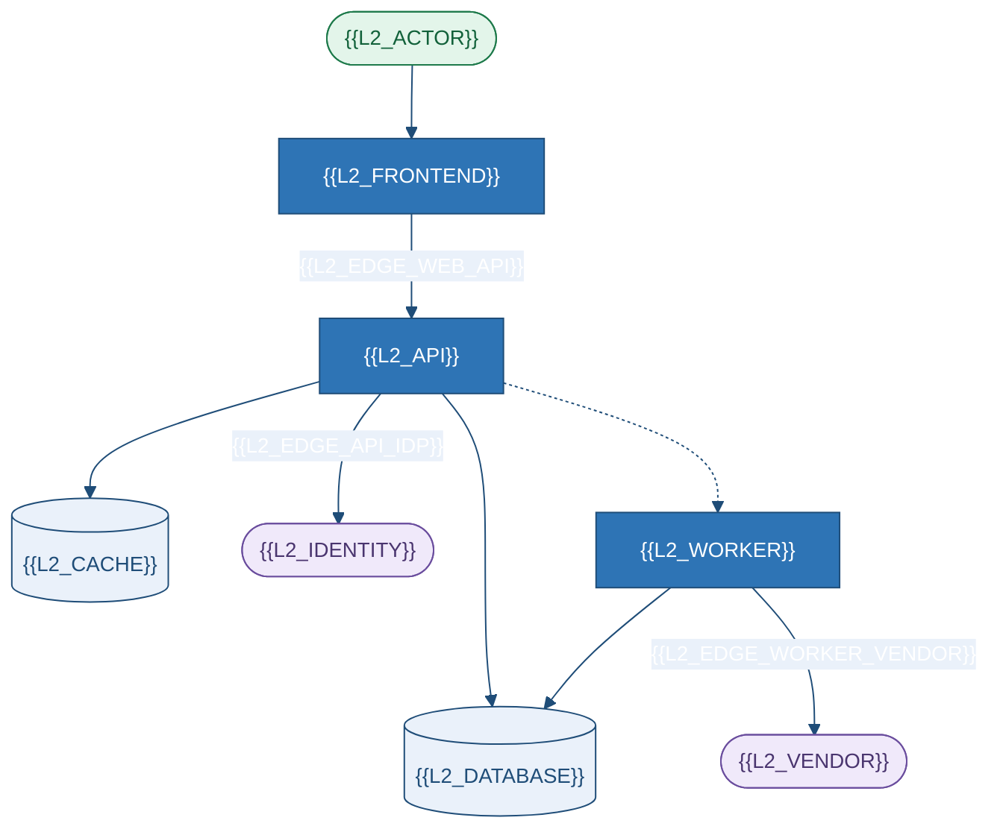
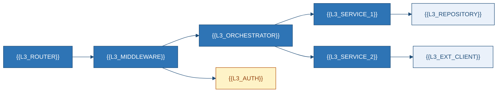
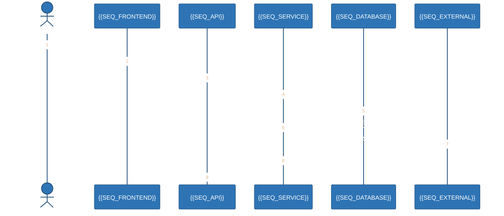
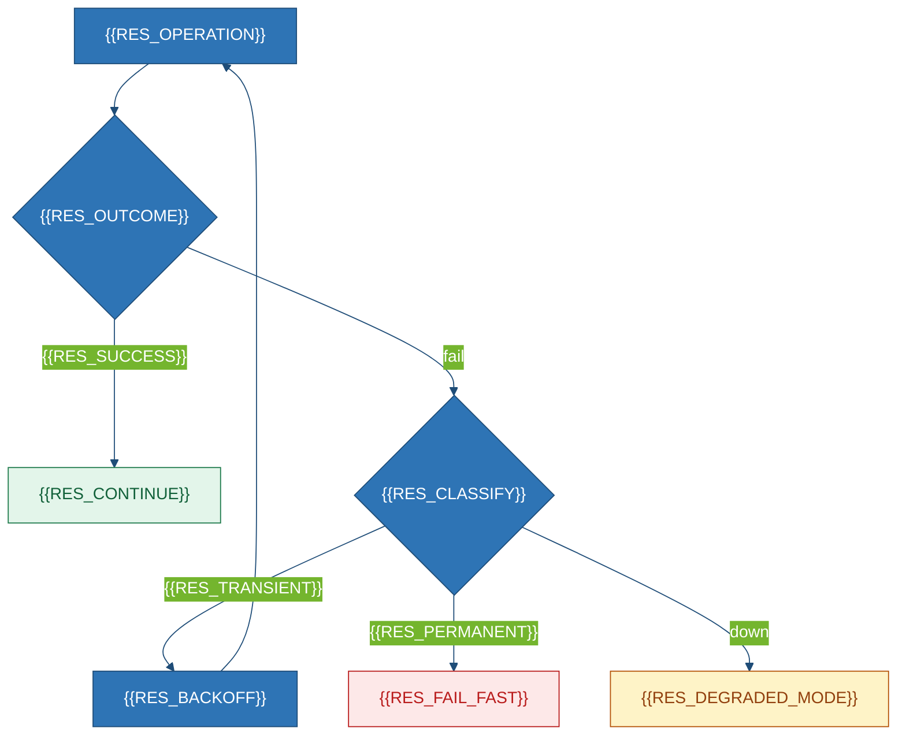
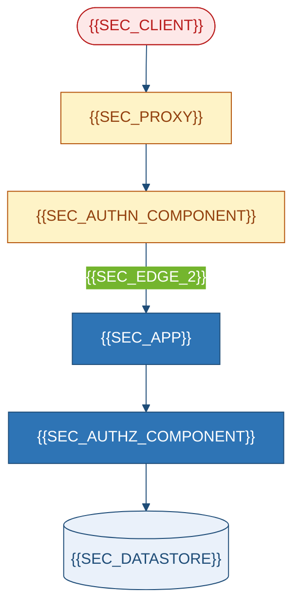

# System Architecture & Design
### {{PROJECT_NAME}}

---

## 1. Architecture at a Glance

{{ARCHITECTURE_SUMMARY}}

| Unit | Type | Runtime | Entry | Stateful? |
|---|---|---|---|---|
{{#EACH deployables}}
| **{{UNIT_NAME}}** | {{UNIT_TYPE}} | {{UNIT_RUNTIME}} | `{{UNIT_ENTRY}}` | {{UNIT_STATEFUL}} |
{{/EACH}}

| # | Decision | Chosen | Not taken | ADR |
|---|---|---|---|---|
{{#EACH defining_decisions}}
| D-{{INDEX}} | {{DECISION_TOPIC}} | {{DECISION_CHOICE}} | {{DECISION_ALTERNATIVE}} | `{{ADR_ID}}` |
{{/EACH}}

---

## 2. Technology Stack

| Layer | Technology | Version | Manifest | Usage | State |
|---|---|---|---|---|---|
{{#EACH stack_runtime}}
| {{STACK_LAYER}} | **{{STACK_TECH}}** | `{{STACK_VERSION}}` | `{{STACK_MANIFEST}}` | `{{STACK_USAGE}}` | {{STACK_STATE}} |
{{/EACH}}

| Deps / Lockfile / Unused / Platform-locked | {{DEP_COUNT}} · {{LOCKFILE_STATUS}} · {{UNUSED_DEPS}} · {{PLATFORM_DEPS}} | `{{DEP_EVIDENCE}}` |

---

## 3. Architecture Views

### 3.1 Context

### 3.2 Containers

| Container | Responsibility | Evidence |
|---|---|---|
{{#EACH containers}}
| **{{CONTAINER_NAME}}** | {{CONTAINER_RESP}} | `{{CONTAINER_EVIDENCE}}` |
{{/EACH}}

### 3.3 Components

| Module | Responsibility | Key symbols | LOC |
|---|---|---|---:|
{{#EACH modules_tier1}}
| `{{MOD_PATH}}` | {{MOD_RESP}} | {{MOD_SYMBOLS}} | {{MOD_LOC}} |
{{/EACH}}

---

## 4. Runtime Views

{{FAILURE_NARRATIVE}} · Retry/Timeout/Breaker/Health: {{CTRL_STATUS}} (`{{CTRL_EVIDENCE}}`)

---

## 5. Security Architecture

{{BOUNDARY_NARRATIVE}}

| STRIDE | Target | Mitigation | Residual | Evidence |
|---|---|---|---|---|
| S/T/R/I/D/E | {{STRIDE_TARGET}} | {{STRIDE_MIT}} | {{STRIDE_RISK}} | `{{STRIDE_EV}}` |

| Secret | Storage | Injection | Evidence |
|---|---|---|---|
{{#EACH secrets}}
| `{{SECRET_NAME}}` | {{SECRET_STORAGE}} | {{SECRET_INJECTION}} | `{{SECRET_EVIDENCE}}` |
{{/EACH}}

| Cross-cutting | Authn/Authz/Validation/Errors/Logging/Config/Secrets — {{XC_SUMMARY}} · Gaps: {{XC_GAPS}} | `{{XC_EVIDENCE}}` |

---

