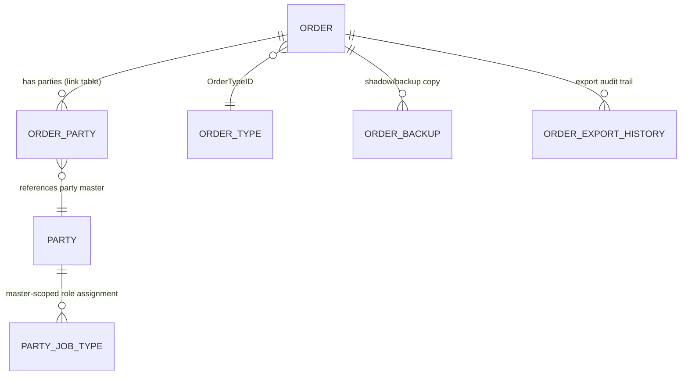
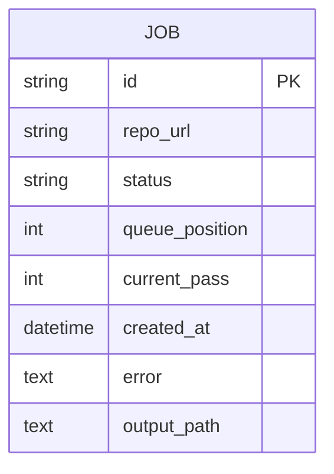
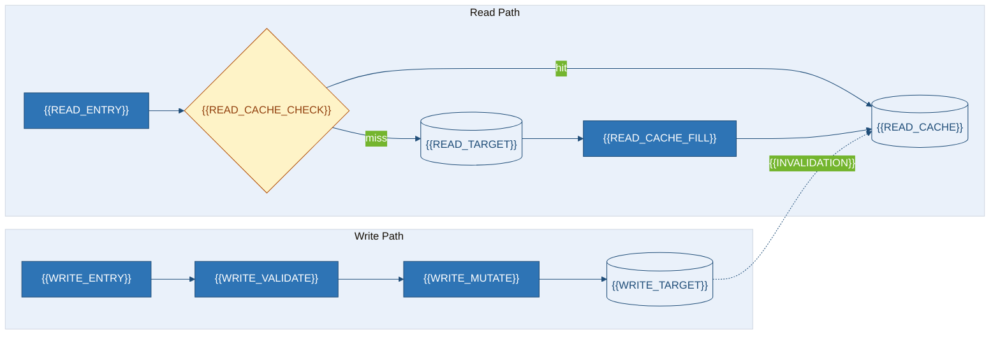

# Database & Data Design
### {{PROJECT_NAME}}
| Field | Value |
|---|---|
| **ID** / **Version** / **Status** | `{{PROJECT_SLUG}}-DBD-001` · `{{DOC_VERSION}}` · `{{DOC_STATUS}}` |
| **Engine** / **Ownership** / **Migrations** | {{DB_ENGINE}} `{{DB_VERSION}}` · {{SCHEMA_OWNERSHIP}} · {{MIGRATION_TOOL}} |
| **Source** | `{{REPO_URL}}` @ `{{COMMIT_SHA}}` · Upstream: *Architecture* |

## 1. Summary & Ownership
{{DATABASE_SUMMARY}} · Datastores {{DATASTORE_COUNT}} / Owned {{TABLE_COUNT}} / Consumed {{CONSUMED_COUNT}} / FKs {{FK_COUNT}} / Indexes {{INDEX_COUNT}} / Migrations {{MIGRATION_COUNT}} / PII tables {{PII_TABLE_COUNT}}
**Posture: {{SCHEMA_OWNERSHIP}}.** {{OWNERSHIP_NARRATIVE}}
| Store | Owned? | Defined in | Discovered how | Evidence |
|---|---|---|---|---|
{{#EACH ownership}}
| {{OWN_STORE}} | {{OWN_OWNED}} | {{OWN_DEFINITION}} | {{OWN_DISCOVERY}} | `{{OWN_EVIDENCE}}` |
{{/EACH}}
> [!IMPORTANT]
> {{OWNERSHIP_CAVEAT}}
| # | Store | Engine | Purpose | Persistence | Evidence |
|---|---|---|---|---|---|
{{#EACH datastores}}
| S-{{INDEX}} | **{{STORE_NAME}}** | {{STORE_ENGINE}} | {{STORE_PURPOSE}} | {{STORE_PERSISTENCE}} | `{{STORE_EVIDENCE}}` |
{{/EACH}}
Driver/pool/principal: {{DB_DRIVER}} · {{POOL_CONFIG}} · {{DB_PRINCIPAL}} (`{{DRIVER_EVIDENCE}}`)

## 2. ERD Diagram
**Conceptual model.** Business-level entities and how they relate, before any physical column detail.
Conceptual ERD Diagram
     Name link tables, shadow/backup copies and audit trails explicitly; they are findings, not noise.

## Attribute-level Entity  

## 3. Physical Schema
{{#EACH tables}}
### 3.{{INDEX}} `{{TABLE_NAME}}`
{{TABLE_PURPOSE}}
| Column | Type | Null | Key | Description | Evidence |
|---|---|:--:|:--:|---|---|
{{#EACH columns}}
| `{{COL_NAME}}` | `{{COL_TYPE}}` | {{COL_NULL}} | {{COL_KEY}} | {{COL_DESC}} | `{{COL_EVIDENCE}}` |
{{/EACH}}
PK `{{TABLE_PK}}` · FKs {{TABLE_FK_OUT}} · Indexes {{TABLE_INDEXES}} · PII {{TABLE_PII}}
{{/EACH}}
| Remaining table | Purpose | Cols | Evidence |
|---|---|---:|---|
{{#EACH remaining_tables}}
| `{{RT_NAME}}` | {{RT_PURPOSE}} | {{RT_COLS}} | `{{RT_EVIDENCE}}` |
{{/EACH}}
## 4. Relationships, Indexes & Classification
| Parent | Child | FK | Cardinality | On delete | Declared? | Evidence |
|---|---|---|---|---|---|---|
{{#EACH relationships}}
| `{{REL_PARENT}}` | `{{REL_CHILD}}` | `{{REL_COLUMN}}` | {{REL_CARDINALITY}} | {{REL_ON_DELETE}} | {{REL_DECLARED}} | `{{REL_EVIDENCE}}` |
{{/EACH}}
| Table | Index | Columns | Unique | Evidence |
|---|---|---|:--:|---|
{{#EACH indexes}}
| `{{IDX_TABLE}}` | `{{IDX_NAME}}` | {{IDX_COLUMNS}} | {{IDX_UNIQUE}} | `{{IDX_EVIDENCE}}` |
{{/EACH}}

## 5. Lifecycle & Query Paths
<!-- ANCHOR: dbd-lifecycle -->
**Record lifecycle.** State machine of the central record, colour-coded by outcome so safe, at-risk and terminal paths are visible at a glance.

```mermaid
%%{init: {'theme':'base','themeVariables':{'primaryColor':'#2E74B5','primaryTextColor':'#ffffff','primaryBorderColor':'#1F4D78','lineColor':'#1F4D78','tertiaryColor':'#EAF1FA','fontFamily':'Segoe UI, Inter, sans-serif'}}}%%
stateDiagram-v2
    direction LR
    [*] --> {{LC_STATE_1}} : {{LC_CREATE}}
    {{LC_STATE_1}} --> {{LC_STATE_2}} : {{LC_T12}}
    {{LC_STATE_2}} --> {{LC_STATE_3}} : {{LC_T23}}
    {{LC_STATE_2}} --> {{LC_STATE_ERR}} : {{LC_T2E}}
    {{LC_STATE_ERR}} --> {{LC_STATE_1}} : {{LC_RETRY}}
    {{LC_STATE_3}} --> {{LC_STATE_ARCHIVE}} : {{LC_ARCHIVE}}
    {{LC_STATE_ARCHIVE}} --> [*] : {{LC_PURGE}}
    {{LC_STATE_ERR}} --> [*] : {{LC_ABANDON}}
    note right of {{LC_STATE_ERR}}
        {{LC_NOTE_ERR}}
    end note
    classDef success fill:#E3F5EA,stroke:#1E7A4B,color:#12613A,stroke-width:1px;
    classDef danger  fill:#FDE8E8,stroke:#B91C1C,color:#B91C1C,stroke-width:1px;
    classDef warn    fill:#FEF3C7,stroke:#B45309,color:#92400E,stroke-width:1px;
    class {{LC_STATE_3}} success
    class {{LC_STATE_ARCHIVE}} success
    class {{LC_STATE_ERR}} danger
    class {{LC_STATE_2}} warn
```
**Read/write path.** How a request reaches durable storage versus the cache, and how the cache is kept from going stale.


## 6. Migrations, Backup, Risks & Assumptions

| Aspect | Detail | Evidence |
|---|---|---|
| Migrations | {{MIGRATION_TOOL}} · `{{MIGRATION_DIR}}` · reversible={{MIGRATION_REVERSIBLE}} · ZDT={{MIGRATION_ZERO_DOWNTIME}} | `{{MIG_TOOL_EVIDENCE}}` |
| Backup / RPO / RTO | {{BACKUP_MECHANISM}} · {{DB_RPO}} · {{DB_RTO}} | `{{BACKUP_EVIDENCE}}` |

{{MIGRATION_SAFETY}}

| ID | Risk / Assumption | Sev / Impact | TODO / Section |
|---|---|---|---|
{{#EACH data_risks}}
| `DR-{{INDEX}}` | {{DR_RISK}} | {{DR_SEVERITY}} | `[PROPOSED]` {{DR_RECOMMENDATION}} |
{{/EACH}}
{{#EACH db_assumptions}}

## 7. Database ER Diagram

```mermaid
%%{init: {'theme':'base','themeVariables':{'primaryColor':'#2E74B5','primaryTextColor':'#ffffff','primaryBorderColor':'#1F4D78','lineColor':'#1F4D78','tertiaryColor':'#EAF1FA'}}}%%
erDiagram
    jobs {
        uuid id PK
        varchar project_name
        varchar repo_url
        varchar source_type "github | azure_devops"
        varchar ai_provider "abacus | azure_ai | mock"
        varchar status "queued | running | completed | failed | cancelled"
        varchar runner_id "nullable"
        varchar failed_stage "nullable"
        varchar error_message "nullable"
        varchar retry_from_stage "nullable"
        int retry_count
        varchar zip_path "nullable"
        timestamp queued_at
        timestamp started_at "nullable"
        timestamp completed_at "nullable"
        timestamp created_at
        timestamp updated_at
    }

    job_secrets {
        uuid id PK
        uuid job_id FK
        text encrypted_pat "nullable — AES-256 encrypted"
        timestamp created_at
    }

    job_progress {
        uuid id PK
        uuid job_id FK
        varchar stage "cloning | analyzing | chunking | llm_analysis | context_building | template_filling | packaging"
        int percent "0-100"
        varchar message "nullable"
        int current_chunk "nullable"
        int total_chunks "nullable"
        int current_template "nullable"
        int total_templates "nullable"
        timestamp updated_at
    }

    file_index {
        uuid id PK
        uuid job_id FK
        varchar file_path
        varchar category
        int file_size_bytes
        varchar language "nullable"
        varchar status "analyzed | skipped"
        varchar skip_reason "nullable"
        timestamp created_at
    }

    chunk_metadata {
        uuid id PK
        uuid job_id FK
        int chunk_number
        varchar category
        jsonb file_paths "array of paths"
        int estimated_tokens
        int line_count
        varchar status "pending | analyzed | failed"
        timestamp created_at
    }

    chunk_analysis {
        uuid id PK
        uuid chunk_id FK
        uuid job_id FK
        jsonb extracted_knowledge "structured JSON"
        jsonb source_mapping "file_path → knowledge_keys"
        int input_tokens
        int output_tokens
        float duration_seconds
        timestamp created_at
    }

    structured_context {
        uuid id PK
        uuid job_id FK
        jsonb context_data "consolidated JSON"
        jsonb source_traceability "section → source files"
        int total_input_tokens
        int total_output_tokens
        timestamp created_at
    }

    template_results {
        uuid id PK
        uuid job_id FK
        varchar template_name
        text generated_content
        int input_tokens
        int output_tokens
        float duration_seconds
        int retry_count
        varchar status "completed | failed"
        timestamp created_at
    }

    output_files {
        uuid id PK
        uuid job_id FK
        varchar filename
        int word_count
        int size_bytes
        timestamp created_at
    }

    job_logs {
        uuid id PK
        uuid job_id FK
        varchar level "info | warn | error | debug"
        varchar stage "nullable"
        text message
        timestamp created_at
    }

    system_stats {
        uuid id PK
        float avg_job_duration_seconds
        int total_jobs_completed
        int total_jobs_failed
        timestamp updated_at
    }

    jobs ||--o| job_secrets : "has"
    jobs ||--o{ job_progress : "tracks"
    jobs ||--o{ file_index : "indexes"
    jobs ||--o{ chunk_metadata : "chunks"
    jobs ||--o{ chunk_analysis : "analyzes"
    jobs ||--o| structured_context : "builds"
    jobs ||--o{ template_results : "generates"
    jobs ||--o{ output_files : "produces"
    jobs ||--o{ job_logs : "logs"
    chunk_metadata ||--o| chunk_analysis : "produces"
```

---