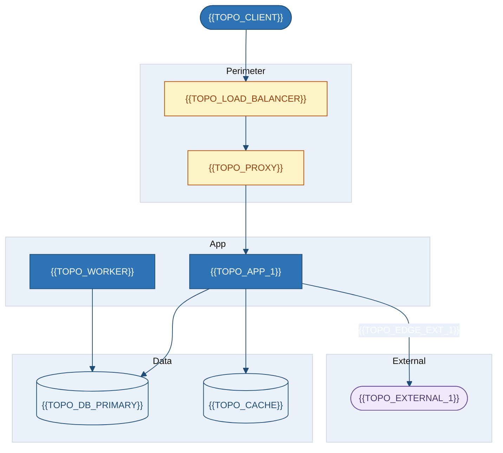
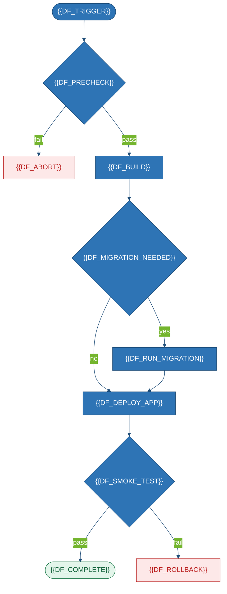
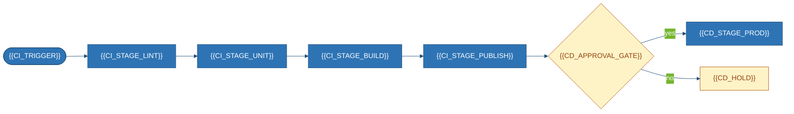
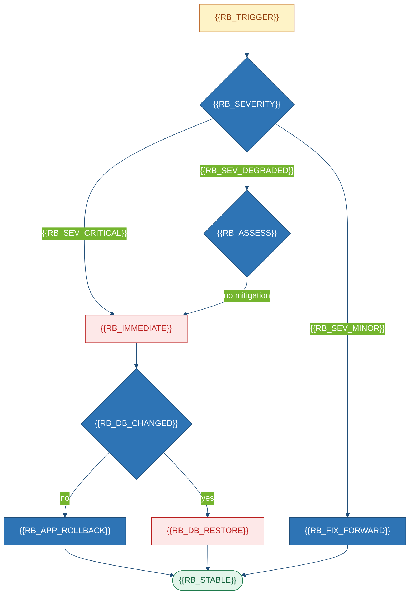

# Deployment & Operations Guide
### {{PROJECT_NAME}}

| Field | Value |
|---|---|
| **ID** / **Version** / **Status** | `{{PROJECT_SLUG}}-DEP-001` · `{{DOC_VERSION}}` · `{{DOC_STATUS}}` |
| **Owner** / **On-call** / **Nature** | `{{DOC_OWNER}}` · {{ONCALL}} · {{DOC_NATURE}} |
| **Source** | `{{REPO_URL}}` @ `{{COMMIT_SHA}}` |

## 1. Summary & Ground Truth

{{DEPLOYMENT_SUMMARY}} · Units {{UNIT_COUNT}} · Envs {{ENV_COUNT}} · Automation {{AUTOMATION_LEVEL}} · Deploy {{DEPLOY_DURATION}} · Rollback {{ROLLBACK_MECHANISM}} · Downtime {{DOWNTIME_REQUIRED}}

| Artifact | Present? | Found at |
|---|---|---|
| CI / CD | {{CI_PRESENT}} / {{CD_PRESENT}} | `{{CI_LOCATION}}` |
| Container / Orchestration / IaC | {{DOCKER_PRESENT}} / {{ORCHESTRATION_PRESENT}} / {{IAC_PRESENT}} | `{{DOCKER_LOCATION}}` |
| Env / Scripts / Monitoring | {{ENVFILE_PRESENT}} / {{SCRIPTS_PRESENT}} / {{MONITORING_PRESENT}} | `{{ENVFILE_LOCATION}}` |

> [!IMPORTANT]
> {{GROUND_TRUTH_STATEMENT}}

## 2. Environments, Prereqs & Local

| Property | Local | {{ENV_2_NAME}} | Production |
|---|---|---|---|
| Hosting / DB | {{LOCAL_HOSTING}} · {{LOCAL_DB}} | {{ENV_2_HOSTING}} · {{ENV_2_DB}} | {{PROD_HOSTING}} · {{PROD_DB}} |
| Deployed by / Approval | Developer / No | {{ENV_2_DEPLOYER}} / {{ENV_2_APPROVAL}} | {{PROD_DEPLOYER}} / {{PROD_APPROVAL}} |

| Tool | Version | Verify |
|---|---|---|
{{#EACH prerequisites}}
| {{PREREQ_TOOL}} | `{{PREREQ_VERSION}}` | `{{PREREQ_VERIFY}}` |
{{/EACH}}

> [!WARNING]
> {{PLATFORM_WARNING}}

```bash
git clone {{REPO_URL}} && cd {{REPO_DIR}}
{{SETUP_STEP_2}}
{{SETUP_STEP_3}}
cp {{ENV_TEMPLATE}} {{ENV_TARGET}}
```

| Component | Command | Port | Notes |
|---|---|---|---|
{{#EACH run_commands}}
| {{RUN_COMPONENT}} | `{{RUN_COMMAND}}` | `{{RUN_PORT}}` | {{RUN_NOTES}} |
{{/EACH}}

## 3. Configuration & Secrets

| Variable | Purpose | Req | Secret | Evidence |
|---|---|:--:|:--:|---|
{{#EACH env_vars}}
| `{{ENV_NAME}}` | {{ENV_PURPOSE}} | {{ENV_REQUIRED}} | {{ENV_SECRET}} | `{{ENV_EVIDENCE}}` |
{{/EACH}}

| Secret | Storage | Rotation | Evidence |
|---|---|---|---|
{{#EACH secrets_mgmt}}
| `{{SM_NAME}}` | {{SM_STORAGE}} | {{SM_FREQUENCY}} | `{{SM_EVIDENCE}}` |
{{/EACH}}

> Names only — never values. Drift: undocumented={{DRIFT_UNDOCUMENTED}} · insecure={{DRIFT_INSECURE}}

## 4. Topology

<!-- ANCHOR: dep-topology -->



## 5. Build, Deploy & CI/CD

```bash
{{BUILD_COMMANDS}}
```

| # | Step | Action | Verify |
|---:|---|---|---|
{{#EACH deploy_steps}}
| {{DS_N}} | {{DS_STEP}} | `{{DS_COMMAND}}` | {{DS_VERIFY}} |
{{/EACH}}





| Stage | Exists | Tool | Evidence |
|---|:--:|---|---|
{{#EACH pipeline_stages}}
| {{PS_STAGE}} | {{PS_EXISTS}} | {{PS_TOOL}} | `{{PS_EVIDENCE}}` |
{{/EACH}}


**Release.** {{RELEASE_STRATEGY}} (`{{STRATEGY_EVIDENCE}}`)

## 6. Rollback

<!-- ANCHOR: dep-rollback -->



| # | Step | Command | Data-loss risk |
|---:|---|---|---|
{{#EACH rollback_steps}}
| {{RS_N}} | {{RS_STEP}} | `{{RS_COMMAND}}` | {{RS_DATA_RISK}} |
{{/EACH}}

## 7. Observability, Backup, Readiness & Gaps

| Signal / Asset | Tool / Method | Gap / Freq | Evidence |
|---|---|---|---|
{{#EACH monitoring}}
| {{MON_SIGNAL}} | {{MON_TOOL}} | {{MON_GAP}} | `{{MON_EVIDENCE}}` |
{{/EACH}}
{{#EACH backups}}
| {{BK_ASSET}} | {{BK_METHOD}} | {{BK_FREQUENCY}} · tested={{BK_TESTED}} | `{{BK_EVIDENCE}}` |
{{/EACH}}

| # | Gate | Status | Blocking? | TODO |
|---|---|:--:|:--:|---|
{{#EACH readiness_gates}}
| G-{{INDEX}} | {{GATE_CRITERION}} | {{GATE_STATUS}} | {{GATE_BLOCKING}} | {{GATE_TODO}} |
{{/EACH}}

**Verdict.** {{READINESS_VERDICT}}

| ID / Gap | Detail | Impact |
|---|---|---|
{{#EACH ops_assumptions}}
| `{{ASSUMPTION_ID}}` | {{ASSUMPTION_TEXT}} | {{ASSUMPTION_IMPACT}} · § {{ASSUMPTION_SECTION}} |
{{/EACH}}
{{#EACH ops_gaps}}
| GAP | {{GAP_ITEM}} · `{{GAP_SEARCH}}` | {{GAP_CONSEQUENCE}} |
{{/EACH}}

<!-- ANCHOR: dep-end -->
*End of `{{PROJECT_SLUG}}-DEP-001` → *`Review and TODO.md`*.*
