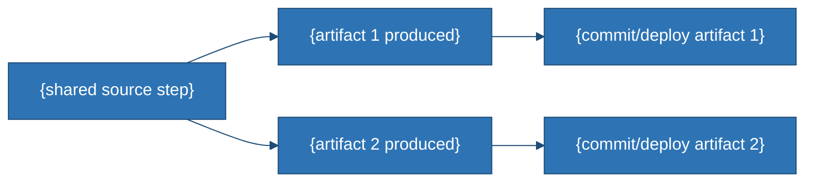

 

# Deployment Guide
### {Project Name}

---

## 1. Overview

{1–2 sentences: how many deployments exist, whether they share infrastructure, and whether CI/CD is in place or deploys are manual.}

| Track | Platform | Live URL |
|---|---|---|
| {Track A} (`{entry file}`) | {Platform} | {URL or "not yet deployed"} |
| {Track B, if applicable} | {Platform} | {URL or "not yet deployed"} |

```mermaid
%%{init: {'theme':'base','themeVariables':{'primaryColor':'#2E74B5','primaryTextColor':'#ffffff','primaryBorderColor':'#1F4D78','lineColor':'#1F4D78','tertiaryColor':'#EAF1FA'}}}%%
flowchart TD
    A["{trigger, e.g. git push to main}"] --> B{"{decision point}"}
    B -->|{Platform A}| C["{what platform A does}"]
    B -->|{Platform B}| D["{what platform B does}"]
    C --> E["{result URL/state}"]
    D --> F["{result URL/state}"]
```

## 2. Prerequisites

- {Account/access requirement 1}
- {Account/access requirement 2}
- {Note on API keys/secrets — state plainly if none are required}

## 3. Environment Variables

{State plainly if none are required, and why. If some exist, list them in a table: name, purpose, required/optional.}

| Variable | Purpose | Required |
|---|---|---|
| `{VAR_NAME}` | {purpose} | {Yes/No} |

## 4. Deploying {Track A}

1. {Step 1}
2. {Step 2}
3. {Step 3 — what installs/builds automatically and from what manifest}
4. {Step 4 — any artifact that must be committed for the build to succeed}
5. {Step 5 — what triggers redeploy}

> {Callout: any failure mode worth flagging, e.g. "the app has no fallback and will fail to start if X is missing."}

## 5. Deploying {Track B, if applicable}

1. {Step 1}
2. {Step 2}
3. {Step 3 — what gets served and how}
4. {Step 4 — what triggers redeploy}

## 6. Keeping Tracks in Sync *(process note, if multiple tracks/artifacts exist)*

{Describe any manual step required to keep parallel artifacts consistent, and whether anything enforces it (CI check, script) or not.}



{One sentence stating the risk if this sync step is skipped, and cross-ref *Review-and-TODO.md*.}

## 7. Rollback

- **{Platform A}:** {rollback mechanism}
- **{Platform B}, if applicable:** {rollback mechanism}
- {One sentence on whether rollback has any data-migration concerns, tying back to *Database-Design.md*.}
