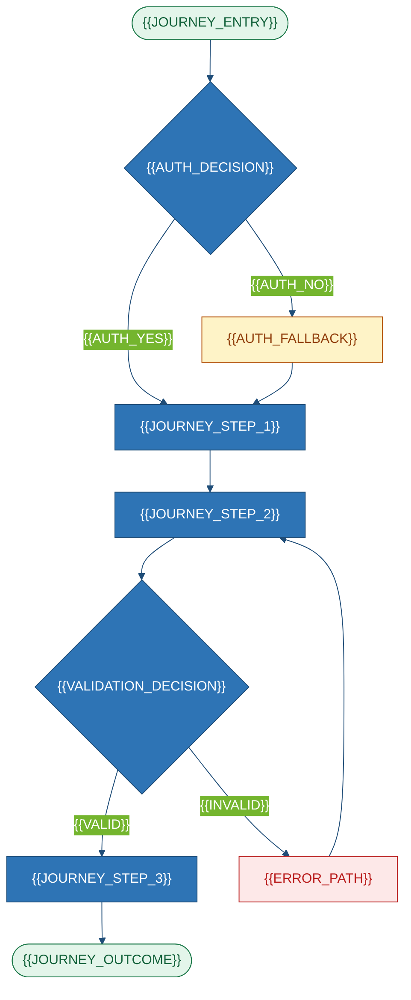

# Product Requirements Document
### {{PROJECT_NAME}}

| Field | Value |
|---|---|
| **ID** / **Version** / **Status** | `{{PROJECT_SLUG}}-PRD-001` · `{{DOC_VERSION}}` · `{{DOC_STATUS}}` |
| **Owner** / **Source** | `{{DOC_OWNER}}` · `{{REPO_URL}}` @ `{{COMMIT_SHA}}` |
| **Generated** / **Confidence** | `{{GENERATED_AT}}` by `{{GENERATOR}}` · `{{CONFIDENCE_PCT}}%` |

---

## 1. Executive Summary
{{EXECUTIVE_SUMMARY}}

| Dimension | Value | Evidence |
|---|---|---|
| Category / Maturity / Users | {{SYSTEM_CATEGORY}} · {{MATURITY}} · {{PRIMARY_USERS}} | `{{EVIDENCE_CATEGORY}}` |
| Deployment / Criticality / Size | {{DEPLOYMENT_MODEL}} · {{CRITICALITY}} · {{LOC}} LOC | `{{EVIDENCE_SIZE}}` |

> [!IMPORTANT]
> {{HEADLINE_CAVEAT}}

---

## 2. Purpose & Capabilities

**Purpose.** {{PURPOSE_NARRATIVE}}

| # | Capability | Description | Evidence |
|---|---|---|---|
{{#EACH capabilities}}
| C-{{INDEX}} | {{CAPABILITY_NAME}} | {{CAPABILITY_DESC}} | `{{CAPABILITY_EVIDENCE}}` |
{{/EACH}}

| # | Does **not** do | Verification |
|---|---|---|
{{#EACH non_capabilities}}
| N-{{INDEX}} | {{NON_CAPABILITY}} | `{{SEARCH_PERFORMED}}` |
{{/EACH}}

| Value | Beneficiary | Evidence |
|---|---|---|
{{#EACH value_props}}
| {{VALUE_PROP}} | {{BENEFICIARY}} | `{{VALUE_EVIDENCE}}` |
{{/EACH}}

---

## 3. System Context

<!-- ANCHOR: system-context -->


{{CONTEXT_NOTES}}

---

## 4. Users & Roles

| Persona | Goal | Entry | Evidence | Conf. |
|---|---|---|---|---|
{{#EACH personas}}
| **{{PERSONA_NAME}}** | {{PERSONA_GOAL}} | {{PERSONA_ENTRY}} | `{{PERSONA_EVIDENCE}}` | {{PERSONA_CONFIDENCE}} {{?PERSONA_ASSUMPTION_ID}} |
{{/EACH}}

| Role | Enforcement | {{CAP_1}} | {{CAP_2}} | {{CAP_3}} |
|---|---|:--:|:--:|:--:|
{{#EACH roles}}
| **{{ROLE_NAME}}** | `{{ROLE_ENFORCEMENT}}` | {{P1}} | {{P2}} | {{P3}} |
{{/EACH}}

{{AUTHZ_NARRATIVE}}

---

## 5. Features & Requirements


| Module | Owns | Entry | Status |
|---|---|---|---|
{{#EACH modules}}
| **{{MODULE_NAME}}** | {{MODULE_RESPONSIBILITY}} | `{{MODULE_ENTRY}}` | {{MODULE_STATUS}} |
{{/EACH}}

| ID | Requirement (RFC 2119) | MoSCoW | Evidence | Conf. |
|---|---|---|---|---|
{{#EACH functional_requirements}}
| `FR-{{INDEX}}` | The system **{{RFC_KEYWORD}}** {{REQUIREMENT_TEXT}} | {{MOSCOW}} | `{{FR_EVIDENCE}}` | {{FR_CONF}} |
{{/EACH}}

---

## 6. Primary Journey

<!-- ANCHOR: primary-journey -->




---

## 7. Integrations & Data

| System | Dir | Protocol | Criticality | Failure behaviour | Evidence |
|---|---|---|---|---|---|
{{#EACH integrations}}
| {{INT_SYSTEM}} | {{INT_DIRECTION}} | {{INT_PROTOCOL}} | {{INT_CRITICALITY}} | {{INT_FAILURE}} | `{{INT_EVIDENCE}}` |
{{/EACH}}

| Entity | Meaning | Owned? | Physical |
|---|---|---|---|
{{#EACH entities}}
| **{{ENTITY_NAME}}** | {{ENTITY_MEANING}} | {{ENTITY_OWNED}} | *`Database Design.md`* |
{{/EACH}}

```mermaid
%%{init: {'theme':'base','themeVariables':{'primaryColor':'#2E74B5','primaryTextColor':'#ffffff','primaryBorderColor':'#1F4D78','lineColor':'#1F4D78','tertiaryColor':'#EAF1FA','fontFamily':'Segoe UI, Inter, sans-serif'}}}%%
stateDiagram-v2
    direction LR
    [*] --> {{STATE_1}} : {{TRANSITION_CREATE}}
    {{STATE_1}} --> {{STATE_2}} : {{TRANSITION_1_2}}
    {{STATE_2}} --> {{STATE_3}} : {{TRANSITION_2_3}}
    {{STATE_2}} --> {{STATE_FAIL}} : {{TRANSITION_2_FAIL}}
    {{STATE_FAIL}} --> {{STATE_1}} : {{TRANSITION_RETRY}}
    {{STATE_3}} --> [*] : {{TRANSITION_TERMINAL}}
```

---

## 8. NFRs, Constraints & Debt

| ID | Area | Requirement | Target / Observed | Evidence |
|---|---|---|---|---|
{{#EACH nfrs}}
| `NFR-{{INDEX}}` | {{NFR_AREA}} | {{NFR_TEXT}} | {{NFR_TARGET}} | `{{NFR_EVIDENCE}}` |
{{/EACH}}

| Constraint / Out of scope | Detail | Evidence |
|---|---|---|
{{#EACH constraints}}
| {{CONSTRAINT_TYPE}} | {{CONSTRAINT_TEXT}} | `{{CONSTRAINT_EVIDENCE}}` |
{{/EACH}}
{{#EACH out_of_scope}}
| OOS | {{OOS_ITEM}} | `{{OOS_SEARCH}}` |
{{/EACH}}

| ID | Debt | Sev | Effort | Evidence |
|---|---|:--:|---|---|
{{#EACH tech_debt}}
| `TD-{{INDEX}}` | {{DEBT_ITEM}} | {{DEBT_SEVERITY}} | {{DEBT_EFFORT}} | `{{DEBT_EVIDENCE}}` |
{{/EACH}}

```mermaid
quadrantChart
    title Debt — impact vs effort
    x-axis "Low effort" --> "High effort"
    y-axis "Low impact" --> "High impact"
    quadrant-1 "Plan"
    quadrant-2 "Fix now"
    quadrant-3 "Monitor"
    quadrant-4 "Accept"
    "{{DEBT_LABEL_1}}": [{{DEBT_X_1}}, {{DEBT_Y_1}}]
    "{{DEBT_LABEL_2}}": [{{DEBT_X_2}}, {{DEBT_Y_2}}]
    "{{DEBT_LABEL_3}}": [{{DEBT_X_3}}, {{DEBT_Y_3}}]
```

| ID | Assumption | Impact if wrong |
|---|---|---|
{{#EACH assumptions}}
| `{{ASSUMPTION_ID}}` | {{ASSUMPTION_TEXT}} | {{ASSUMPTION_IMPACT}} |
{{/EACH}}
> See *`Review and TODO.md`*.
*End of `{{PROJECT_SLUG}}-PRD-001` → *`Architecture Design.md`*.*
