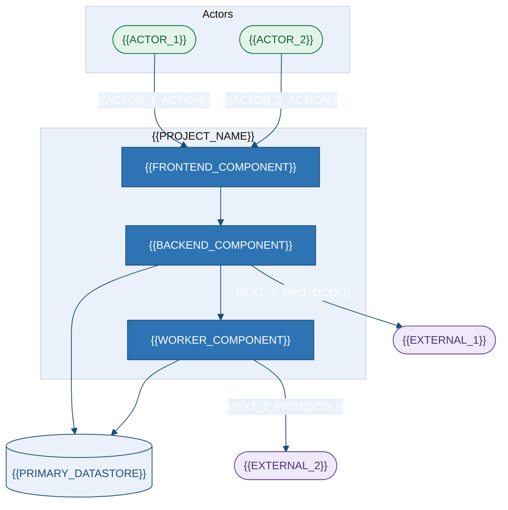
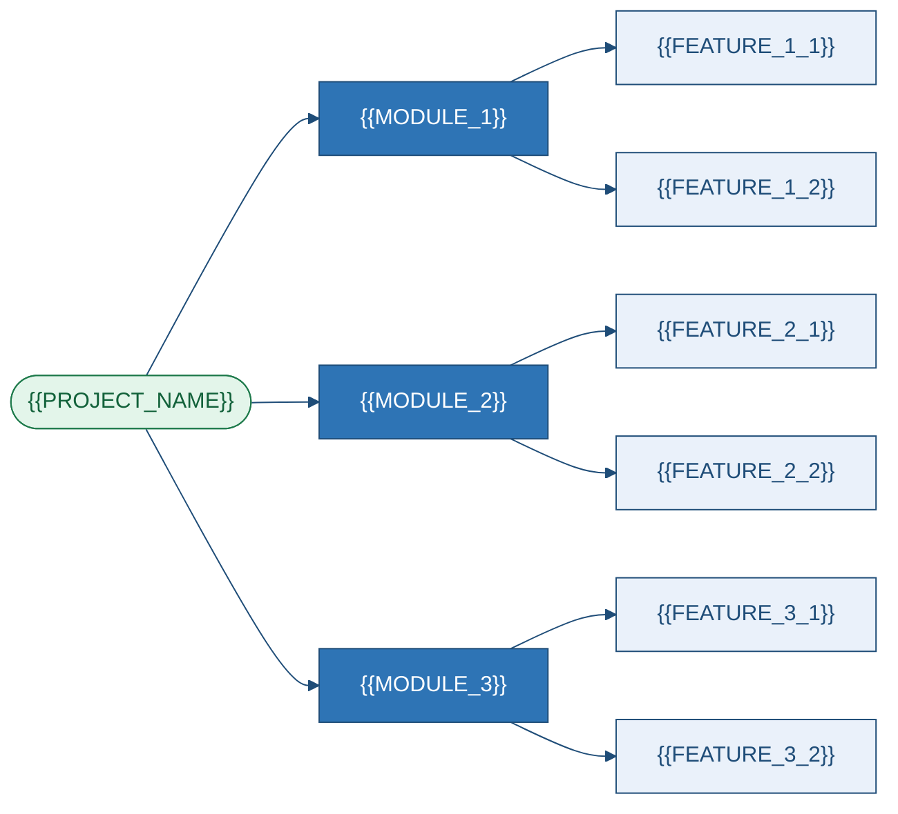

# Product Requirements Document
### {{PROJECT_NAME}}

## 1. Executive Summary
{{EXECUTIVE_SUMMARY}}

| Dimension | Value | Evidence |
|---|---|---|
| Category / Maturity / Users | {{SYSTEM_CATEGORY}} · {{MATURITY}} · {{PRIMARY_USERS}} | `{{EVIDENCE_CATEGORY}}` |
| Deployment / Criticality / Size | {{DEPLOYMENT_MODEL}} · {{CRITICALITY}} · {{LOC}} LOC | `{{EVIDENCE_SIZE}}` |

> [!IMPORTANT]
> {{HEADLINE_CAVEAT}}

---

## 2. Purpose & Capabilities

**Purpose.** {{PURPOSE_NARRATIVE}}

| # | Capability | Description | Evidence |
|---|---|---|---|
{{#EACH capabilities}}
| C-{{INDEX}} | {{CAPABILITY_NAME}} | {{CAPABILITY_DESC}} | `{{CAPABILITY_EVIDENCE}}` |
{{/EACH}}

| # | Does **not** do | Verification |
|---|---|---|
{{#EACH non_capabilities}}
| N-{{INDEX}} | {{NON_CAPABILITY}} | `{{SEARCH_PERFORMED}}` |
{{/EACH}}

| Value | Beneficiary | Evidence |
|---|---|---|
{{#EACH value_props}}
| {{VALUE_PROP}} | {{BENEFICIARY}} | `{{VALUE_EVIDENCE}}` |
{{/EACH}}

---

## 3. System Context

<!-- ANCHOR: system-context -->

{{CONTEXT_NOTES}}

---

## 4. Users & Roles

| Persona | Goal | Entry | Evidence | Conf. |
|---|---|---|---|---|
{{#EACH personas}}
| **{{PERSONA_NAME}}** | {{PERSONA_GOAL}} | {{PERSONA_ENTRY}} | `{{PERSONA_EVIDENCE}}` | {{PERSONA_CONFIDENCE}} {{?PERSONA_ASSUMPTION_ID}} |
{{/EACH}}

| Role | Enforcement | {{CAP_1}} | {{CAP_2}} | {{CAP_3}} |
|---|---|:--:|:--:|:--:|
{{#EACH roles}}
| **{{ROLE_NAME}}** | `{{ROLE_ENFORCEMENT}}` | {{P1}} | {{P2}} | {{P3}} |
{{/EACH}}

{{AUTHZ_NARRATIVE}}

---

## 5. Features & Requirements

| Module | Owns | Entry | Status |
|---|---|---|---|
{{#EACH modules}}
| **{{MODULE_NAME}}** | {{MODULE_RESPONSIBILITY}} | `{{MODULE_ENTRY}}` | {{MODULE_STATUS}} |
{{/EACH}}

| ID | Requirement (RFC 2119) | MoSCoW | Evidence | Conf. |
|---|---|---|---|---|
{{#EACH functional_requirements}}
| `FR-{{INDEX}}` | The system **{{RFC_KEYWORD}}** {{REQUIREMENT_TEXT}} | {{MOSCOW}} | `{{FR_EVIDENCE}}` | {{FR_CONF}} |
{{/EACH}}

---

