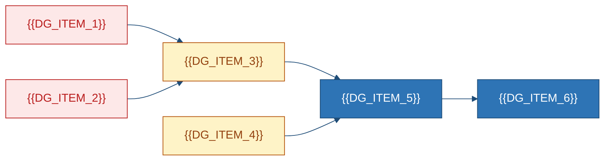

# Review, Risk Register & Remediation Backlog
### {{PROJECT_NAME}}
## 1. Executive Verdict

{{EXECUTIVE_VERDICT}}

| Dimension | Rating | Basis |
|---|:--:|---|
| Functional / Architecture / Security | {{RATING_FUNCTIONAL}} / {{RATING_ARCHITECTURE}} / {{RATING_SECURITY}} | {{BASIS_FUNCTIONAL}} |
| Data / Reliability / Testing | {{RATING_DATA}} / {{RATING_RELIABILITY}} / {{RATING_TESTING}} | {{BASIS_DATA}} |
| **Overall / Production** | **{{RATING_OVERALL}}** / {{RATING_PRODUCTION}} | {{BASIS_OVERALL}} |

| Rank | Action | Why now | Effort | TODO |
|---:|---|---|---|---|
{{#EACH top_actions}}
| {{TA_RANK}} | {{TA_ACTION}} | {{TA_WHY}} | {{TA_EFFORT}} | `{{TA_TODO_ID}}` |
{{/EACH}}

**Method.** {{METHOD_DESCRIPTION}} · Inspected {{INSPECTED_COUNT}}/{{REPO_FILE_COUNT}} @ `{{COMMIT_SHA}}`. {{REVIEW_LIMITS}}

## 2. Confidence, Assumptions, Gaps & Conflicts

| Document | V/I/U | Confidence | Weakest |
|---|---|---:|---|
| PRD / Arch / DB | {{PRD_V}}/{{PRD_I}}/{{PRD_U}} · {{ARC_V}}/{{ARC_I}}/{{ARC_U}} · {{DBD_V}}/{{DBD_I}}/{{DBD_U}} | {{PRD_CONF}}%/{{ARC_CONF}}%/{{DBD_CONF}}% | § {{PRD_WEAK}} |
| API / Deploy / Review | {{API_V}}/{{API_I}}/{{API_U}} · {{DEP_V}}/{{DEP_I}}/{{DEP_U}} · {{REV_V}}/{{REV_I}}/{{REV_U}} | {{API_CONF}}%/{{DEP_CONF}}%/{{REV_CONF}}% | § {{API_WEAK}} |
| **Overall** | **{{TOTAL_V}}/{{TOTAL_I}}/{{TOTAL_U}}** | **{{CONFIDENCE_PCT}}%** | — |

{{CONFIDENCE_NARRATIVE}}

| ID | Category / Item | Detail | Source / Validate |
|---|---|---|---|
{{#EACH assumptions_register}}
| `{{AR_ID}}` | {{AR_CATEGORY}} | {{AR_STATEMENT}} | *{{AR_SOURCE_DOC}}* § {{AR_SECTION}} · {{AR_VALIDATION}} |
{{/EACH}}
{{#EACH gap_register}}
| GAP-{{GR_N}} | {{GR_ITEM}} | `{{GR_SEARCH}}` | *{{GR_SOURCE_DOC}}* · `{{GR_TODO_ID}}` |
{{/EACH}}
{{#EACH conflicts}}
| CF-{{CF_N}} | Conflict | {{CF_DESCRIPTION}} | `{{CF_SOURCE_A}}` vs `{{CF_SOURCE_B}}` → {{CF_PREFERRED}} |
{{/EACH}}

## 3. Findings

| Sev | Definition |
|---|---|
| 🔴 High / 🟠 Medium | Exploitable or blocks purpose / Incidents or toil |
| 🟡 Low / 🟢 Info | Quality issue / observation |


| ID | Sev | Finding | Evidence | Recommendation | TODO |
|---|:--:|---|---|---|---|
{{#EACH findings}}
| `{{F_ID}}` | {{F_SEVERITY}} | {{F_TITLE}} | `{{F_EVIDENCE}}` | `[PROPOSED]` {{F_RECOMMENDATION}} | `{{F_TODO_ID}}` |
{{/EACH}}

{{#EACH high_findings}}
#### `{{HF_ID}}` — {{HF_TITLE}}

**What.** {{HF_DESCRIPTION}} · **Why.** {{HF_IMPACT}} · **Evidence.** `{{HF_EVIDENCE}}` · **Fix.** `[PROPOSED]` {{HF_RECOMMENDATION}} · **Effort.** {{HF_EFFORT}} · **TODO.** `{{HF_TODO_ID}}`

```gherkin
Given {{HF_GIVEN}}
When  {{HF_WHEN}}
Then  {{HF_THEN}}
```
{{/EACH}}

## 4. Security, Reliability & Quality

| Control / Check | Status / Result | Gap / Evidence |
|---|---|---|
| Authn / Authz / Input / Secrets / TLS / Rate | {{SC_AUTHN}} | {{SC_AUTHN_GAP}} · `{{SC_AUTHN_EV}}` |
| Hardcoded creds / secrets in templates / logs | {{SEC_HARDCODED}} | {{SEC_HARDCODED_EV}} |
| Unit / Integration / E2E | {{UNIT_PRESENT}}/{{INT_PRESENT}}/{{E2E_PRESENT}} · {{UNIT_COUNT}} · CI={{UNIT_CI}} | `{{UNIT_EVIDENCE}}` |
| Largest file / >1k LOC / Dead code | {{LARGEST_FILE}} / {{BIG_FILES}} / {{DEAD_CODE}} | `{{LARGEST_EVIDENCE}}` |

{{TESTING_NARRATIVE}}

| ID | Sev | Finding | Evidence | TODO |
|---|:--:|---|---|---|
{{#EACH ops_findings}}
| `{{OF_ID}}` | {{OF_SEVERITY}} | {{OF_FINDING}} | `{{OF_EVIDENCE}}` | `{{OF_TODO_ID}}` |
{{/EACH}}

## 5. Risk Register & Debt

| ID | Risk / Debt | L×I / Interest | Control / Effort | TODO |
|---|---|---|---|---|
{{#EACH risks}}
| `{{RK_ID}}` | {{RK_RISK}} | {{RK_SCORE}} | {{RK_CONTROL}} | `{{RK_TODO_ID}}` |
{{/EACH}}
{{#EACH debt_ledger}}
| `{{DL_ID}}` | {{DL_DEBT}} | {{DL_INTEREST}} | {{DL_EFFORT}} | `{{DL_TODO_ID}}` |
{{/EACH}}

```mermaid
quadrantChart
    title Risk — likelihood vs impact
    x-axis "Unlikely" --> "Near certain"
    y-axis "Minor" --> "Severe"
    quadrant-1 "Mitigate now"
    quadrant-2 "Contingency"
    quadrant-3 "Monitor"
    quadrant-4 "Reduce likelihood"
    "{{RISK_LABEL_1}}": [{{RISK_X_1}}, {{RISK_Y_1}}]
    "{{RISK_LABEL_2}}": [{{RISK_X_2}}, {{RISK_Y_2}}]
    "{{RISK_LABEL_3}}": [{{RISK_X_3}}, {{RISK_Y_3}}]
    "{{RISK_LABEL_4}}": [{{RISK_X_4}}, {{RISK_Y_4}}]
```

## 6. Remediation Backlog

| Priority | Meaning |
|---|---|
| **P0** / **P1** / **P2** / **P3** | Blocks prod · Before {{NEXT_MILESTONE}} · Next quarter · Opportunistic |

| ID | P | Item | Effort | Depends | Acceptance |
|---|:--:|---|---|---|---|
{{#EACH backlog}}
| `{{TD_ID}}` | {{TD_PRIORITY}} | {{TD_ITEM}} | {{TD_EFFORT}} | {{TD_DEPENDS}} | {{TD_ACCEPTANCE}} |
{{/EACH}}



```mermaid
gantt
    title {{PROJECT_NAME}} — remediation
    dateFormat YYYY-MM-DD
    section P0
    {{GANTT_P0_1}} :crit, p0a, {{GANTT_P0_1_START}}, {{GANTT_P0_1_DUR}}
    section P1
    {{GANTT_P1_1}} :active, p1a, after p0a, {{GANTT_P1_1_DUR}}
    {{GANTT_P1_2}} :p1b, after p0a, {{GANTT_P1_2_DUR}}
    section P2
    {{GANTT_P2_1}} :p2a, after p1a, {{GANTT_P2_1_DUR}}
```

| # | Quick win | Effort | Benefit | TODO |
|---|---|---|---|---|
{{#EACH quick_wins}}
| {{QW_N}} | {{QW_ACTION}} | {{QW_EFFORT}} | {{QW_BENEFIT}} | `{{QW_TODO_ID}}` |
{{/EACH}}

## 7. Completeness & Sign-off

```text
[ ] Six docs, exact filenames, headings retained
[ ] Mermaid quotas met; init line + classDefs present
[ ] Citations on non-trivial claims; no secret values
[ ] Assumption/gap counts match the other five docs
[ ] No [PROPOSED] outside this doc / Recommendations
[ ] No <!-- FILL --> / <!-- EXAMPLE --> left in output
```

| Measure | Value |
|---|---|
| LOC / Endpoints / Tables / Findings (H/M/L) | {{STAT_LOC}} · {{STAT_ENDPOINTS}} · {{STAT_TABLES}} · {{HIGH_COUNT}}/{{MEDIUM_COUNT}}/{{LOW_COUNT}} |
| Assumptions / Gaps / P0 / Confidence | {{ASM_TOTAL}} · {{GAP_TOTAL}} · {{P0_COUNT}} · {{CONFIDENCE_PCT}}% |

| Role | Name | Decision | Date |
|---|---|---|---|
| Author | {{GENERATOR}} | Generated | {{GENERATED_AT}} |
| Eng / Security | {{SIGNOFF_ENG}} / {{SIGNOFF_SEC}} | {{SIGNOFF_ENG_DECISION}} | {{SIGNOFF_ENG_DATE}} |

> Generated from `{{COMMIT_SHA}}`. Validate `[ASSUMPTION-*]` before decisions.

<!-- ANCHOR: rev-end -->
*End of `{{PROJECT_SLUG}}-REV-001`.*
